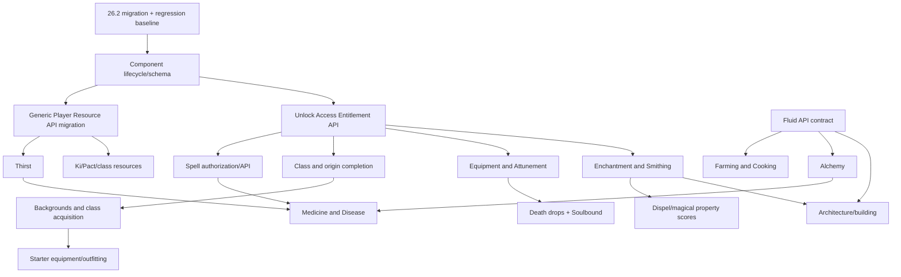

# Totality Dependency and Readiness Map

Audit date: 2026-07-15. “Ready” means current code does not expose a prerequisite blocker; it does not mean final design is known.

## Existing foundations

Reachable foundations include a custom persistent/synced player-component container, registries/events, server payload handlers, item data components, attributes/skills/classes/ancestry/abilities, spell slots and concentration, equipment slots, Credits and banking, item pricing/trading, dialogue/quests, rest sessions, fluid storage, UE machines, and data reloaders. Evidence begins at `Totality.onInitialize()`, `TotalityClient.onInitializeClient()`, `ModComponents.register()`, and `TotalityPackets.register()`.

## Current dependency relationships

| System | Depends on | Dependents | Dependency type | Abstraction/readiness |
|---|---|---|---|---|
| Components | ServerPlayer mixin, NBT, payload codec | nearly all player APIs | runtime/server+client | Working but needs schema/lifecycle gate |
| Mana/Stamina | shared resource component, events, tick loops, packets, HUD | spells/movement/rest | runtime/server authority + client mirror | Values are consolidated; behavior/client paths remain domain-specific |
| Abilities | registry, component, ticks, inputs | classes/origins/items/HUD | runtime | Working, grants not source-aware |
| Classes/ancestry | registries, stats, components, packets | grants, spell slots, UI | runtime + conceptual | Selection/levels exist; content incomplete |
| Spells | abilities, slots, concentration, entities, items | disease intervention, classes | runtime/server+client | Execution exists; authorization foundation incomplete |
| Equipment | component, inventory menu, packets | phone, attunement, death/Soulbound | runtime | Working custom slots; lifecycle policy incomplete |
| Economy | wallet/item components, NPC/dialogue, reload data | shops/phone/quests | runtime + data-driven | BUY/SELL usable; runtime durability incomplete |
| Fluids | Fabric Transfer API, BEs/items | processing/plumbing/vehicles | runtime | Concrete implementation, universal contract not designed |
| Worldgen | registries, biome-source mixin, features | structures/environment | startup/worldgen | Migration-sensitive; runtime verification required |

Initialization order matters: components and content are registered before packet handlers and API events; reload listeners populate data after startup; client receivers/renderers must remain client-only. Most pure calculators can be unit tested independently, while mixins, save lifecycle, screens, worldgen and multiplayer sessions need integration tests.

## Upcoming-work readiness

| Work | Readiness | Blockers/prerequisites | Recommendation |
|---|---|---|---|
| Minecraft 26.2 migration | Proceed first | mixin/worldgen/render/payload regression surface | Isolated migration task with client/dedicated/save/worldgen matrix |
| Generic Player Resource API | Delay until migration baseline | generic definitions/behavior and component save compatibility | Complete migration with adapters/save fixtures; do not redo shared storage |
| Thirst resource | Delay | generic resource migration; final mechanics from design conversations | Implement as first universal-resource acceptance case afterward |
| Fluid API | Design clarification, then can proceed | distinguish existing tank/Transfer implementation from broader contract | Preserve tank vertical slice; define consumers first |
| Unlock/Access/Entitlement API | Proceed after component baseline | legacy grant migration/source mapping | Foundation before spell/class/origin/equipment grants |
| Spell API | Delay | U/A/E, server authorization, concentration cleanup, known/prepared intent | Complete after grant ownership |
| Ability Check API | Partially ready | resolver already exists; integration/extension requirements unclear | Audit call sites and add tests; avoid replacement without a gap |
| Class/origin completion | Delay | U/A/E; class feature ownership; design clarification | Content may be authored in parallel, wiring later |
| Backgrounds/class acquisition | Delay | class model, U/A/E, multiclass allocation rules | Search earlier design chats for final acquisition rules |
| Starter equipment/outfitting | Delay | background/class acquisition; death policy; physical Credits | Define idempotent grant/source tracking first |
| Equipment death drops | Delay | unified death matrix | Runtime-test vanilla/custom slots first |
| Soulbound | Delay | U/A/E or item ownership semantics; death policy | Do not implement as an isolated mixin |
| Equipment/Attunement | Partially ready | current components/handlers exist; lifecycle/capacity validation | Stabilize and test before expansion |
| Farming/Cooking | Design clarification | item grade/freshness, fluids, resource consumers | Can prototype data schemas after migration, not full ecosystem |
| Alchemy | Existing vertical slice; generalized API delayed | planned formula/knowledge scope; fluids | Preserve existing brewing while designing extension points |
| Medicine/Disease | Delay | disease lifecycle design, resources, spells, items | Requires earlier-chat design and cross-system contracts |
| Enchantment/Smithing | Delay | equipment/item property ownership, U/A/E; design | Establish magical-property use cases first |
| Architecture/building | Design clarification and migration first | structures/worldgen, fluids, energy, persistence/scale | Defer broad system; isolated blocks can proceed only with clear scope |

## Systems that can proceed independently

After the 26.2 baseline: add tests for pure ability-check/combat calculators; improve data validation for existing reloaders; complete concentration cleanup; verify phone gating; and test merchant persistence. These do not require inventing future API designs.

## Systems needing runtime verification

All component death/reconnect paths, multiplayer rest, merchant restart/unload, phone and screen reachability, attunement removal/death, malicious packet rejection, fluid/energy side access, dedicated-server startup, spell negative authorization, and fresh-world biome/feature generation.

## Systems needing design clarification

Final multiclass acquisition/allocation, backgrounds, starter equipment composition, physical Credits policy, Soulbound semantics, known/prepared spells, final Fluid API scope, disease lifecycle, Farming/Cooking quality/freshness, Medicine, Enchantment/Smithing property model, and Architecture/environmental simulation. Production code cannot establish these final rules; consult canonical documents and earlier ChatGPT conversations, with newer decisions overriding older discussion.
