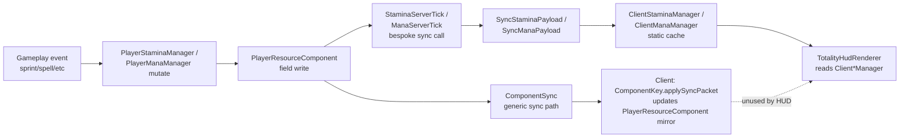
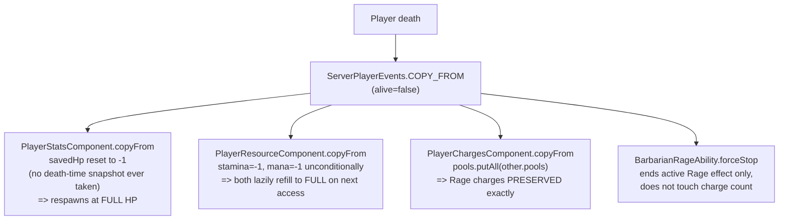
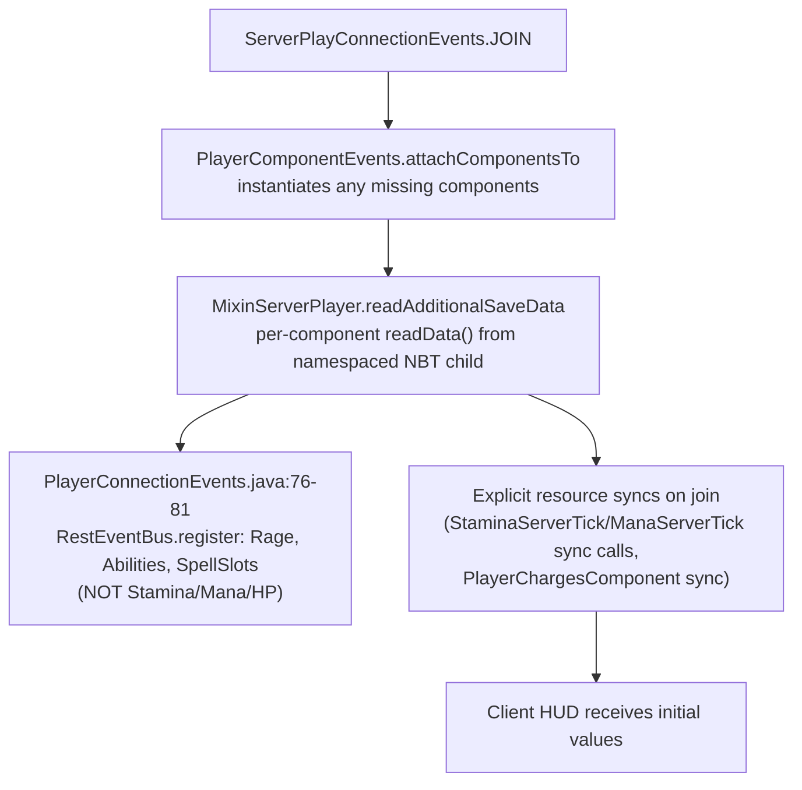
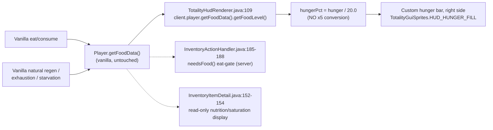
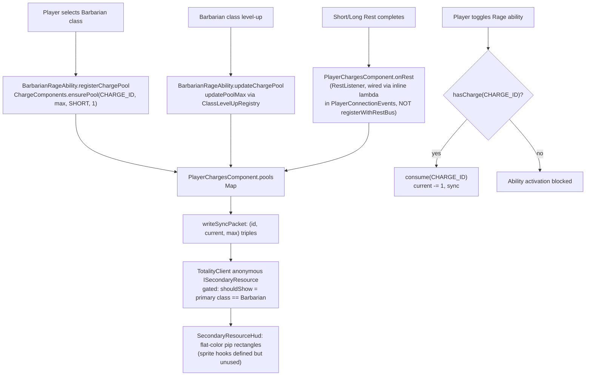

# TOTALITY GENERIC PLAYER RESOURCE API — IMPLEMENTATION READINESS AUDIT

**Status:** Original audit (2026-07-17) was read-only. The Oxygen-to-Breath addendum below was also read-only. The "Stage 2 Implementation Record" section records the inert Phase 0/1 Resource API foundation. The "Phase 2A"/"Phase 2B"/"Phase 2C" Implementation Records (Health/Food, then Breath, then Mana/Stamina) all reached READY TO COMMIT with a passed manual smoke test. The "Phase 2C Implementation Record" section (2026-07-19) records the Mana and Stamina **transitional, query-only, legacy-store** external adapters, and the "Phase 2C Correction Pass" section (same day) fixed two issues found on review — an unnecessary maximum-calculation event dispatch for uninitialized queries, and an unconstrained adapter-returned-failure-reason trust boundary in `PlayerResourceService`. The registry now holds five production definitions (`totality:health`, `totality:food`, `totality:breath`, `totality:mana`, `totality:stamina`), 301/301 automated tests pass, build/datagen validation succeeds, and Stefan's manual smoke test on the real 26.2 client passed ("Mana and Stamina behaved exactly as before, with no visible gameplay changes or regressions") — see "Phase 2C Final Status" at the very end of this document for the full result. Do not treat any earlier "no production resources exist"/"Breath not yet registered"/"Mana and Stamina not yet registered" statement anywhere in this document as current.
**Date:** 2026-07-17 (original audit); Oxygen-to-Breath addendum and Stage 2 foundation added 2026-07-17; Phase 2A record added 2026-07-19; Phase 2B record added 2026-07-19; Phase 2C record added 2026-07-19
**Branch:** `feature/general-resource-api` (based on `master` @ `bc16cc3`, "Merge Provisioner Phase 4")
**Scope:** `src/main/java/zcylas/totality/**` only. `/Inspiration Mods` was excluded from every search, count, and conclusion below.
**Canonical design authority:** `Context/Audit/TOTALITY_GENERIC_PLAYER_RESOURCE_API.md` (2026-07-13, CANONICAL/IMPLEMENTATION-READY), reconciled against `Context/Audit/TOTALITY_POST_AUDIT_DESIGN_DECISIONS.md` (later, overrides where they conflict) and `Context/Audit/TOTALITY_SHARED_CROSS_SYSTEM_FOUNDATIONS.txt`.

---

## Oxygen-to-Breath Audit Addendum (2026-07-17)

**Scope of this addendum:** read-only research performed immediately before the Phase 0/1 foundation implementation (see the new "Stage 2 Implementation Record" section at the end of this document), to determine whether an Oxygen/Air/Breathing external adapter is safe to scaffold as part of the inert foundation. `/Inspiration Mods` excluded, as with the rest of this report.

### Findings

1. **Vanilla vs. custom storage.** Totality uses vanilla `LivingEntity` air supply **completely unmodified**. A repo-wide search for `getAirSupply`, `setAirSupply`, `getMaxAirSupply`, and `AIR_SUPPLY` returned zero matches. No `AirComponent`/`OxygenComponent`/`BreathComponent` or any Totality-side storage exists anywhere in `src/main/java/zcylas/totality`.
2. **Current/maximum values.** No attribute, mixin, or species bonus modifies air capacity anywhere. Vanilla defaults (current int tracked on the entity, max 300 ticks / 15s) are fully authoritative and untouched.
3. **Depletion/restoration.** Entirely vanilla `LivingEntity.baseTick()` logic. No mixin targets `baseTick`, `decreaseAirSupply`, `increaseAirSupply`, or `isEyeInFluid` (confirmed across all 43 mixin classes). The only Totality-side touchpoints near drowning are cosmetic/classificatory, not mechanical: `init/events/VanillaDamageInterceptor.java:224` reclassifies vanilla `"drown"` damage as `DamageTypes.BLUDGEONING` for the DR/resistance system (does not touch air depletion or damage timing), and `api/rpg/skills/core/MasteryRegistry.java:100-101` describes a Mining mastery perk granting immunity to **block-suffocation** (`in_wall`), which is an unrelated vanilla damage type from being embedded in solid blocks, not underwater air loss.
4. **Persistence.** Vanilla NBT only — no Totality file reads or writes an air/oxygen NBT tag.
5. **Synchronization.** No Totality packet/payload relates to air or oxygen; sync (if any) is vanilla `SynchedEntityData`, untouched by Totality.
6. **HUD rendering.** `TotalityHudRenderer.java:80-82` replaces vanilla `HEALTH_BAR`/`ARMOR_BAR`/`FOOD_BAR` with no-op renderers, but **`VanillaHudElements.AIR_BAR` is never referenced anywhere** — it is not hidden, replaced, or redrawn. Vanilla's own air-bubble HUD element still renders through the normal vanilla pipeline, reading vanilla `getAirSupply()` internally. Because Totality already relocates the Food bar (to the HUD's right side, mirroring HP) that vanilla's air bubbles are normally anchored near, the vanilla air-bubble element likely now renders at a screen position that no longer aligns with Totality's relocated hunger bar — a **pre-existing cosmetic side effect**, not a new one introduced by this task, and not a functional bug in air handling itself.
7. **Existing stable identifiers.** Zero matches for `totality:oxygen`, `totality:air`, or `totality:breath` (or the bare strings "oxygen"/"air"/"breath" as identifiers) anywhere in the codebase. **No naming collision exists** for a future `totality:breath` identifier.
8. **Species/ability/item breathing hooks.** `api/rpg/skills/alchemy/AlchemyEffects.java:295-307` defines a custom Alchemy potion effect (`waterbreathing`) that applies vanilla `MobEffects.WATER_BREATHING` — a thin wrapper around a vanilla status effect, not a custom air mechanic. No "doesn't need to breathe," gills, Aquatic-species, or Kryptonian-breathing logic exists anywhere in `api/rpg/ancestry/**` or the ability packages (checked `SpeciesData.java`, `PlayerAncestryComponent.java`, `AncestryComponents.java`, `SpeciesRegistry.java`, `HeatVisionAbility.java` — none reference air/oxygen/breath/drown/suffocation).
9. **Mixins on air-related vanilla methods.** None (see #3).
10. **Commands.** `TotalityCommands.java` has no air/oxygen/breath/drown/suffocation subcommand.

### Determinations (per the ten audit questions)

1. Oxygen currently uses **vanilla air supply directly**, with no custom storage.
2. Authoritative current/maximum values are **entirely vanilla** (current tracked on the entity; max 300 ticks), unmodified by Totality.
3. Depletion/restoration is **entirely vanilla tick logic** — no Totality tick handler or mixin intervenes.
4/5. Persistence and synchronization are **entirely vanilla** — no Totality code touches either.
6. The "existing Oxygen HUD" is **entirely vanilla's own air-bubble element** — Totality has never built a custom oxygen bar (unlike HP/Stamina/Mana/Hunger, which all have Totality-drawn replacements). There is nothing Totality-authored to preserve or reuse for oxygen specifically, only vanilla's own rendering, which is already running with a likely cosmetic misalignment against Totality's relocated Food bar.
7. **No stable Totality identifier exists yet** for oxygen/air/breath — `totality:breath` is free to register with zero migration collision.
8. **No save-data, packet, or identifier migration will be required.** There is no legacy Totality air state to import, no legacy packet to retire, and no legacy identifier to alias — the cleanest of all five original-scope resources plus this addendum's target.
9. **Breath should be an external adapter** over vanilla air supply, structurally identical to how Health wraps vanilla `getHealth()`/`setHealth()` and Food wraps vanilla `FoodData` — vanilla air remains authoritative for underwater/vacuum-equivalent depletion exactly as vanilla `FoodData` remains authoritative for Hunger. This is consistent with the task's own expectation ("Breath is expected to adapt the existing air authority unless Stage 1 proves otherwise") and nothing found here proves otherwise.
10. **No species with unusual breathing rules currently has any hook to preserve** — Kryptonian, and every other implemented species, breathes using unmodified vanilla air supply today. A future Breath adapter introducing environment-specific behavior (vacuum, smoke, unbreathable atmospheres, non-oxygen-breathing species) will be genuinely new work, not a migration of any existing hook.

### Migration risk

**None identified.** This is a strictly greenfield adapter target: no storage, no packets, no identifiers, no species hooks, and no custom HUD element exist to migrate, alias, or retire. The only pre-existing wrinkle (the vanilla air-bubble HUD element's likely cosmetic misalignment with Totality's relocated Food bar) predates this task, is unrelated to the Resource API, and is out of scope for both this addendum and the Stage 2 foundation work below.

### Recommendation

**No architectural blocker exists.** Proceeding to Stage 2 is safe. `totality:breath` should be planned as an `EXTERNAL_ADAPTER`-authority resource wrapping vanilla air supply, following the same shape as the future Health and Food adapters, when a later phase actually registers it. Per the task's explicit instructions, **Breath is not registered, renamed, or implemented in Stage 2** — this addendum only confirms the foundation types being added in Stage 2 (`ResourceStateAuthority.EXTERNAL_ADAPTER`, external-adapter-identifier fields on `PlayerResourceDefinition`) are structurally sufficient to represent Breath later, without requiring any core-architecture change once Breath is actually designed and registered.

---

## 1. Executive summary

**Current readiness: architecturally ready to begin, behaviorally not started.**

The canonical design (`TOTALITY_GENERIC_PLAYER_RESOURCE_API.md`) is complete, internally consistent, and does not need to be reopened to begin work. No commits on this branch have touched `api/rpg/resources/` yet — the branch is at the same tip as `master`. This audit's job was to check whether the *codebase* is ready for that design to land on top of it, not to re-litigate the design.

**Major findings**

1. **HP, Stamina, Mana, and Rage are four genuinely different architectures today**, not four instances of one pattern:
   - **HP** has no manager at all — every consumer calls vanilla `getHealth()/setHealth()/getMaxHealth()` directly. No component. No resource-shaped abstraction exists yet.
   - **Stamina and Mana** already share one real component (`PlayerResourceComponent`) via near-duplicate manager classes (`PlayerStaminaManager`, `PlayerManaManager`) — the closest thing to "generic" in the repo, but it is a fixed two-field class (`stamina`, `mana`), not a keyed/extensible pool.
   - **Rage** already lives in a genuinely generic, `Identifier`-keyed, multi-pool component (`PlayerChargesComponent`) with its own Rest, sync, and persistence wiring — this is architecturally closer to the canonical design's `PARTITIONED_POOL`/`GENERIC_COMPONENT` shape than anything called "Resource" in the repo.
2. **Hunger is clean.** Vanilla `FoodData` is untouched and undupli­cated; access is concentrated in ~5 call sites, not scattered. Vanilla's hunger bar is already hidden (`VanillaHudElements.FOOD_BAR` replaced with a no-op) and a Totality-drawn hunger bar already exists on the HUD's right side, but it renders the raw `0–20` value with **no ×5 conversion applied anywhere** — this is the one concrete, low-risk piece of the ×5 requirement that is not yet done.
3. **Long Rest currently restores none of HP, Stamina, or Mana.** Only Rage (via `PlayerChargesComponent.onRest`), Abilities, and standard spell slots are wired into `RestEventBus`. This is a real, pre-existing gap the canonical design explicitly expects to close (Phase 7/Phase 2B), not something this audit invented.
4. **Death/respawn behavior is inconsistent per-resource today**, independent of the Resource API: HP is preserved via a disconnect-only NBT snapshot (`PlayerStatsComponent.savedHp`) that does *not* fire on death, so death currently always respawns at full HP; Stamina/Mana are unconditionally reset to "uninitialized" on every `copyFrom` (death **and** ordinary dimension change alike); Rage charges are copied through unmodified on any respawn including death. None of this is broken *for current gameplay*, but a naive generic `RespawnStrategy.ALWAYS_COPY` applied uniformly would silently change at least two of these behaviors — the design's per-resource `ResourceLifecyclePolicy` concept exists specifically to prevent that, and this audit confirms it is *necessary*, not just cautious.
5. **Sync is double-implemented for Stamina/Mana.** `PlayerResourceComponent` is itself a `SyncedComponent` wired through the generic `ComponentSync` framework, but `StaminaServerTick`/`ManaServerTick`/`PlayerResourceRecalculator` *also* send bespoke `SyncStaminaPayload`/`SyncManaPayload` packets independently. Both paths currently work, but this is exactly the kind of duplicated wire protocol the migration must collapse to one.
6. **Three independent full-player-list server tick loops already exist** (`Totality.java` passive ticker, `StaminaServerTick`, `ManaServerTick`) even though Stamina and Mana share one component today. Adding Rage, Ki, Thirst, etc. as more independent `END_SERVER_TICK` loops would compound this; the design's `ResourceTickScheduler` concept is directly aimed at this measured problem, not a hypothetical one.
7. **Ki and Solar Charge have zero backing implementation.** No `PlayerKiManager`, no `MonkClass` Ki grant, no Solar Charge state anywhere in production code. They must be classified **designed but not implemented**, matching the task's explicit instruction not to mark them implemented.
8. **The HUD overlap defect is real and independently confirmed**: the left-side bar cluster (`TotalityHudRenderer.java`) is laid out from fixed screen-edge offsets, and the off-hand attack indicator (`renderOffhandAttackIndicator`) is laid out from fixed screen-center offsets. Neither routine is aware of the other's occupied rectangle, there is no shared layout manager, and Mana's `if (maxMana > 0)` visibility check does not cause Stamina to re-stack into the freed slot — confirming the HUD has no dynamic-visibility behavior at all today, only one conditional show/hide.

**Recommended implementation order** (detailed in §11): Phase 0 characterization tests → Core registry/service/state component (no migration) → Health/Food external adapters (both exercised immediately since their vanilla authorities already exist) → generic sync/client presentation → migrate Mana+Stamina → migrate Rage → migrate spell slots → Hunger ×5 adapter and formatter unification with HP → dormant definitions (Ki, Solar Charge, Thirst, Sanity, Fatigue) → minimal HUD overlap fix → legacy cleanup → verification. This matches the canonical document's own Phase 0–8 sequence; this audit did not find repository evidence to reorder it. *(Correction, 2026-07-18: an earlier version of this line also named Temperature as a stub adapter target. Current decision: Temperature is owned by a future Environment/Physiology system, not the Resource API — see the Stage 2 Pre-Commit Correction Record at the end of this document.)*

**Can implementation begin without reopening the closed design?** **Yes.** Nothing found in the codebase contradicts a locked decision in `TOTALITY_GENERIC_PLAYER_RESOURCE_API.md` or `TOTALITY_POST_AUDIT_DESIGN_DECISIONS.md`. The only genuinely new information this audit contributes is *exactly which* legacy code the design's Phase 0–8 must account for, itemized below.

---

## 2. Current resource inventory

### 2.1 HP / Health

| Aspect | Current state |
|---|---|
| Authoritative storage | Vanilla `LivingEntity.getHealth()`/`setHealth()` (float) and `Attributes.MAX_HEALTH`. No Totality component. |
| Current-value access | Direct `player.getHealth()` at 7+ call sites (no manager) — `api/rpg/stats/PlayerResourceRecalculator.java:43-46`, `effect/FortifyHealthEffect.java:102-103`, `api/combat/condition/ConditionServerTick.java:59`, `api/rpg/skills/alchemy/AlchemyEffects.java:42`, `init/TotalityCommands.java:105,626,782,786`, `client/renderer/hud/TotalityHudRenderer.java:103-104`, `screen/character/tabs/OverviewTab.java:105-106`. |
| Maximum-value calculation | `StatAttributeApplier.applyConHp` (`api/rpg/stats/StatAttributeApplier.java:50-65`) applies a transient `AttributeModifier` (`CON_HP_ID`) to `Attributes.MAX_HEALTH`, sized via `PlayerStats.getMaxHpBonus() = CON modifier * 5` (`PlayerStats.java:174-176`). Applied from `PlayerResourceRecalculator.recalculate/recalculateAndRestore`. No equipment/effect contribution to max HP exists (unlike Stamina/Mana, which have `StaminaItem`/`ManaItem` hooks). |
| Modification pathways | Vanilla damage/heal pipeline, unmodified. Direct writes: `FortifyHealthEffect.java:103`, `ConditionServerTick.java:59` (`heal(0.2f)`), `AlchemyEffects.java:42` (`heal(getMaxHealth())`), admin commands (`TotalityCommands.java:105,626`), recalculation clamp (`PlayerResourceRecalculator.java:44-46`). |
| Regeneration | No custom system. Vanilla saturation-based natural regen only, plus the one-off `ConditionServerTick` tick heal (not a general regen policy). |
| Persistence | `PlayerStatsComponent.savedHp` (float, NBT key `ps_hp`) — written **only** on disconnect (`StatsServerEvents.java:46` → `saveCurrentResources()`), read on every `COPY_FROM` (join/respawn/dimension change) via `restoreResources()` (`PlayerStatsComponent.java:36-40`), which sets HP to `min(savedHp, maxHp)` or full if `savedHp < 0` (never disconnected since last reset). |
| Death behavior | `copyFrom` (`PlayerStatsComponent.java:112-124`) unconditionally resets `savedHp = -1` regardless of `alive` — since `saveCurrentResources()` only runs on disconnect (not death), **a death that isn't preceded by a disconnect always respawns at full HP today.** This is existing, shipped behavior, not a bug introduced by this audit. |
| Synchronization | None dedicated — rides vanilla's own `ClientboundSetHealthPacket`. |
| HUD rendering | `TotalityHudRenderer.java`: vanilla `HEALTH_BAR` replaced with a no-op (`:80`); custom bar reads `client.player.getHealth()/getMaxHealth()` directly (`:103-104`), smoothed via `hpSmooth` (`SmoothValue`, `:71`), displayed through `RpgDisplayUtils.toDisplayHp()` (`RpgDisplayUtils.java:30-32`, confirmed exact ×5: `Math.round(vanillaHp * 5)`). This is the **one real, working ×5 formatter already in the codebase** — reused by `OverviewTab.java:105-106` and `FortifyHealthEffect.java:79`. |
| Dependencies | `PlayerResourceRecalculator`, `StatAttributeApplier`, `PlayerStatsComponent`, vanilla combat/death pipeline, mob health bars (separately implemented, not shared with player HP formatting — see §5). |
| **Status** | **Implemented but architecture-specific/legacy** — fully functional gameplay, zero resource-shaped abstraction, one real display-conversion utility already correct and reusable. |

### 2.2 Stamina

| Aspect | Current state |
|---|---|
| Authoritative storage | `PlayerResourceComponent.stamina` (int, `api/rpg/resources/PlayerResourceComponent.java:20`), `-1` sentinel = uninitialized. |
| Current-value access | `PlayerStaminaManager.getStamina(Player)` (`api/rpg/stamina/PlayerStaminaManager.java:34-42`) — lazily initializes to max on first access. All other code goes through this manager. |
| Maximum-value calculation | `PlayerStaminaManager.getMaxStamina()` (`:64-111`): base `100` + `PlayerStats.getMaxStaminaBonus()` (`END modifier * 10`, `PlayerStats.java:178-180`, confirmed live) + armor-slot `StaminaItem` bonuses + `ModEffects.FORTIFY_STAMINA` + held-item `StaminaItem` (deduplicated vs. armor) + `MaxStaminaCalcEvent` hook (`api/rpg/stamina/base/MaxStaminaCalcEvent.java`). **Note:** a second, dead formula exists — `RpgDisplayUtils.endModifierToStaminaBonus()` (`RpgDisplayUtils.java:58-60`) computes `END modifier * 5`, contradicting the live `*10` formula, and is called from nowhere in the codebase. This is a real duplicated/contradictory-formula finding, not a hypothetical one. |
| Modification pathways | `setStamina/addStamina/removeStamina/hasStamina` (`PlayerStaminaManager.java:44-62`). Spenders: sprint drain (`networking/stamina/StaminaServerTick.java:105`), flight drain (`:84`), melee attack cost (`api/rpg/combat/weapon/WeaponStaminaHandler.java:28`), bow draw/crossbow load (`api/rpg/combat/bow/BowStaminaHandler.java:64,89`), plus `GroundSlamAbility`, `VeinminerAbility`, `PowerAttackManager`/`PowerAttackVerification`, `ShurikenItem`, several weapon mixins, `OffhandAttackHandler`/`Verification`, `MovementStaminaHandler`, `PowerSprintStateHandler`, `ToggleFlightHandler`. |
| Regeneration | `StaminaServerTick` every 20 ticks; blocked while sprinting-with-stamina, power-sprinting, bow drawn, or flying; rate = `max(1, max * regenPercent)`, `regenPercent` differs in/out of combat (`0.05` vs `0.02`, `PlayerStaminaManager.java:22,29`, via `CombatStateManager.isInCombat`), further modified by `ExhaustionManager.getRegenMultiplier()` (0.5 exhausted / 0.75 warning / 1.0 normal) and `StaminaRegenCalcEvent`. |
| Persistence | `PlayerResourceComponent.writeData/readData`, NBT key `"stamina"` (int, default `-1`). |
| Death behavior | `PlayerResourceComponent.copyFrom` (`:90-95`) **unconditionally** resets `stamina = -1` on every respawn copy (death, dimension change, End return — all identical), regardless of `alive`. |
| Synchronization | **Double path.** (a) `PlayerResourceComponent` is itself a `SyncedComponent` synced through the generic `ComponentSync` framework; (b) `networking/stamina/SyncStaminaPayload` (bespoke record, full value) sent independently from `StaminaServerTick.syncStamina()` after every drain/regen and on join. Both are live simultaneously. |
| HUD rendering | `TotalityHudRenderer.java:105-106,143-145`, bottom bar of the left-side stack, smoothed via `staminaSmooth`, reads `ClientStaminaManager` (a separate client-side cache populated by the bespoke payload, not by the generic component sync). |
| Dependencies | `PlayerStats`, `CombatStateManager`, `ExhaustionManager`, movement/combat handlers listed above, `ClientStaminaManager`. |
| **Status** | **Partially implemented (functional, non-generic)** — real gameplay works end-to-end, but storage is a fixed two-field component (not keyed/extensible), sync is duplicated, and Long Rest does not restore it (confirmed absent from every `RestEventBus.register` call site). |

### 2.3 Mana

| Aspect | Current state |
|---|---|
| Authoritative storage | `PlayerResourceComponent.mana` (int, same class as Stamina, `:21`). |
| Current-value access | `PlayerManaManager.getMana(Player)` (`api/rpg/mana/PlayerManaManager.java:18-26`), identical lazy-init pattern to Stamina. |
| Maximum-value calculation | `PlayerManaManager.getMaxMana()` (`:48-92`): base `100` + `PlayerStats.getMaxManaBonus()` (`INT modifier * 10`, `PlayerStats.java:182-184`, confirmed live) + armor `ManaItem` + `ModEffects.FORTIFY_MANA` + held-item `ManaItem` + `MaxManaCalcEvent`. Same dead-formula issue exists here too: `RpgDisplayUtils.intModifierToManaBonus()` (`*5`) is unused. |
| Modification pathways | `setMana/addMana/removeMana/hasMana` (`PlayerManaManager.java:28-46`). Spenders: `api/magic/grimoire/context/FormulaResolver.java:33,35` (spell cast cost), `api/ability/kryptonian/HeatVisionAbility.java`, `item/magic/GrimoireItem.java`. |
| Regeneration | `ManaServerTick` every 20 ticks, **unconditional** (no combat/activity gating, unlike Stamina) — rate `max(1, max * regenPercent)`, base `0.02` + armor/effect (`ModEffects.REGENERATE_MANA`)/held-item bonuses + `ManaRegenCalcEvent`. |
| Persistence | Same component, NBT key `"mana"`. |
| Death behavior | Same unconditional reset to `-1` on every respawn copy as Stamina. |
| Synchronization | Same double-path pattern: generic `ComponentSync` + bespoke `SyncManaPayload` sent from `ManaServerTick.syncMana()` and `PlayerResourceRecalculator`. |
| HUD rendering | `TotalityHudRenderer.java:107-108,147-151`, middle bar, **only drawn `if (maxMana > 0)`** — the one existing conditional-visibility example in the current HUD, but Stamina's Y position does not shift to fill the gap when Mana is hidden. |
| Dependencies | `PlayerStats`, `FormulaResolver`/spellcasting, `ClientManaManager`. |
| **Status** | **Partially implemented (functional, non-generic)** — same structural pattern and gaps as Stamina; also absent from every Rest listener. |

### 2.4 Rage (Barbarian)

| Aspect | Current state |
|---|---|
| Authoritative storage | `PlayerChargesComponent` (`api/rpg/classes/PlayerChargesComponent.java`), a genuinely generic `Map<Identifier, ChargePool>` where `ChargePool` is a record `(current, max, rechargeType, rechargeAmount)`. Rage is keyed by `BarbarianRageAbility.CHARGE_ID = totality:barbarian_rage` (`api/ability/impl/barbarian/BarbarianRageAbility.java:18-20`). |
| Current-value access | `ChargeComponents.get(player).getCurrent/getMax(CHARGE_ID)`. |
| Maximum-value calculation | `BarbarianRageAbility.RAGE_CHARGES` (`:30-32`), a hardcoded `int[25]` indexed by **Barbarian class level** (not player level), applied via `registerChargePool`/`updateChargePool` (`:139-151`), called from class selection (`SelectClassHandler.java:52`), respawn re-registration, and `BarbarianClass`'s `ClassLevelUpRegistry` callback (`BarbarianClass.java:69-71`). Dead code: `PlayerChargesComponent.toClassLevel()` (`:173-175`, player-level→class-level `/4` conversion) is never called; the real class-level source is `ClassComponents`. |
| Modification pathways | `ChargeComponents.get(player).consume(CHARGE_ID)` (`PlayerChargesComponent.java:42-48`) on Rage activation (`BarbarianRageAbility.onActivate`, `:66-81`), gated by `hasCharge` in `canActivate` (`:52-64`). |
| Regeneration | None passive — Rest-only (see below). |
| Persistence | Generic per-pool NBT: `PoolCount` + `Pool_{i}_id/current/max/rest/amount` (`PlayerChargesComponent.java:131-158`) — already keyed by `Identifier` string, round-trips any pool, not Rage-specific code. |
| Death behavior | `ChargeComponents` uses `RespawnStrategy.ALWAYS_COPY`; `copyFrom` (`:160-164`) does a straight `pools.putAll` — **Rage charges are preserved through death**, unlike Stamina/Mana. `StatsServerEvents.java:50-57` calls `BarbarianRageAbility.forceStop` on death, but that only ends the *active* Rage buff/effect, not the charge count. |
| Synchronization | `writeSyncPacket/applySyncPacket` (`:103-127`) sends pool count + `(id, current, max)` triples generically — one clean sync path, unlike Stamina/Mana's double path. |
| HUD rendering | `client/hud/resource/SecondaryResourceHud.java` + an `ISecondaryResource` anonymous implementation registered in `TotalityClient.registerRenderers()` (`:127-153`) reads `ChargeComponents` directly and gates visibility on primary class == Barbarian. Renders flat-color pip rectangles — the intended sprite hooks (`TotalityGuiSprites.HUD_RAGE_PIP`/`HUD_RAGE_PIP_SPENT`) are wired but never actually invoked by the renderer (dead cosmetic code, separate from the resource-architecture question). |
| Rest integration | `PlayerChargesComponent.onRest` (`:82-96`) implements `RestListener`: Short Rest → `+1` (registered `rechargeAmount=1`), Long Rest → full. Confirmed wired via inline lambdas in `PlayerConnectionEvents.java:76-77` (join) and `:129-131` (respawn) — **not** via `PlayerChargesComponent.registerWithRestBus()`, which is a confirmed dead no-op method, called from nowhere. |
| Dependencies | `BarbarianClass`, `SelectClassHandler`, `ClassComponents`, `RestEventBus`/`RestManager`, `TotalityClient` HUD registration. |
| **Status** | **Implemented and verified** — Rage is the most complete, most correctly Rest-integrated, and most architecturally "generic-shaped" resource in the current codebase, despite predating any Resource API design. It is the best existing reference pattern for the new `PARTITIONED_POOL`/keyed-charge shape, not a legacy system to be flattened. |

### 2.5 Hunger (adapter target, vanilla-authoritative)

| Aspect | Current state |
|---|---|
| Authoritative storage | Vanilla `Player.getFoodData()` (`FoodData`). **Confirmed: no Totality-side duplicate component exists anywhere in the codebase.** |
| Current-value access | `TotalityHudRenderer.java:109` (`client.player.getFoodData().getFoodLevel()`, client-side, HUD only), `InventoryActionHandler.java:185-188` (server-side eat-gate check via `needsFood()`), `InventoryItemDetail.java:152-154` (read-only tooltip display of `food.nutrition()`/`food.saturation()` off vanilla `FoodProperties`). |
| Maximum-value calculation | Vanilla constant `20`, hardcoded at the one HUD read site (`TotalityHudRenderer.java:114`, `hunger / 20.0`). |
| Modification pathways | No item sets non-zero nutrition/saturation anywhere — all Totality "food" items (alchemy ingredients, potions) use `nutrition(0).saturationModifier(0f).alwaysEdible()` purely to be consumable/drinkable for UX, not to feed the player (`init/items/SKIngredientItems.java:16-20`, `init/TotalityRegistry.java:133,252,284,314,341,368,393`). The one direct vanilla-hunger write in the whole codebase is `item/magic/rune/effect/HealEffect.java:71-72` (`player.causeFoodExhaustion(2.5f)`, mirroring vanilla's own healing-costs-exhaustion convention). |
| Regeneration | Entirely vanilla (natural regen tied to food level, unmodified). |
| Persistence | Entirely vanilla (`FoodData` NBT, untouched). |
| Death behavior | Entirely vanilla. |
| Synchronization | Entirely vanilla. |
| HUD rendering | `TotalityHudRenderer.java:80-82` replaces vanilla `FOOD_BAR` with a no-op (same treatment as `HEALTH_BAR`/`ARMOR_BAR`); a **Totality-drawn** hunger bar is rendered on the HUD's right side (`:160-164`, `TotalityGuiSprites.HUD_HUNGER_FILL`) using the raw `0–20` value **with no ×5 conversion applied anywhere** — confirmed by grep: no scaling utility analogous to `RpgDisplayUtils.toDisplayHp` exists for hunger. |
| Dependencies | `HudElementRegistry` (Fabric), `TotalityGuiSprites`, `InventoryActionHandler`, `InventoryItemDetail`. |
| **Status** | **Implemented but unconverted (vanilla-authoritative, no adapter)** — the cleanest of the five resources architecturally (no duplication, no scattering), but explicitly missing the ×5 display step this task requires, and missing any `PlayerResourceService`-shaped query surface for other systems (Rest, Survival, Diet) to read Food through later. |

**Naming-collision flag carried over from research:** `api/rpg/combat/exhaustion/ExhaustionManager`/`ExhaustionState` is a **Totality-only concept derived from the Stamina resource** (low-stamina combat penalty), completely unrelated to vanilla `FoodData.exhaustion`/`causeFoodExhaustion`. The two "exhaustion" systems share a name but never touch each other's state. Do not conflate them during Hunger adapter design — the canonical resource doc's §24.9 rule ("never migrate combat Exhaustion into Rest Need") applies to this same class by extension: `ExhaustionManager` must not be folded into the Hunger adapter or a future Fatigue resource without a separate explicit decision.

---

## 3. File and symbol map

Paths are relative to `src/main/java/zcylas/totality/`.

### 3.1 Shared component framework (`api/core/component/`)
| File | Relevance |
|---|---|
| `TotalityComponent.java` | Base interface (`readData`/`writeData`) every player-data component implements — the Resource API's `PlayerResourceStateComponent` will implement this same interface. |
| `ComponentKey.java` | Typed handle (`get`, `maybeGet`, `sync`) — the Resource API needs exactly one new `ComponentKey<PlayerResourceStateComponent>`, obtained via `ComponentRegistry.getOrCreate`, same as every other component. |
| `ComponentContainer.java` | Per-player `LinkedHashMap` holder — no changes needed; the framework already supports arbitrary numbers of components. |
| `ComponentProvider.java` | Interface implemented by `ServerPlayer` (via `MixinServerPlayer`) — supplies sync recipients and the default `syncComponent` dispatch the Resource API will reuse unmodified. |
| `RespawnStrategy.java` | `ALWAYS_COPY`/`LOSSLESS_ONLY`/`WITH_INVENTORY`/`NEVER_COPY` — confirms the canonical design's plan (§17.1: register the whole component `ALWAYS_COPY`, apply per-resource death policy inside `copyFrom`) is the *only* pattern this framework actually supports; there is no per-field respawn strategy mechanism, so `ResourceLifecyclePolicy` must be applied entirely inside the new component's own `copyFrom`, exactly like `PlayerResourceComponent`/`PlayerChargesComponent` already do today. |
| `ComponentRegistry.java` | Static `Identifier → ComponentKey` map — registration point for `totality:resources` (already taken by the existing `PlayerResourceComponent`; the new component will need either a renamed identifier or to literally become the migrated replacement — see §7). |
| `ComponentSync.java` | The one shared sync payload (`totality:component_sync`) + `STREAM_CODEC` — this is the "generic snapshot packet" transport the canonical design's Phase 3 wants; it already exists and is proven (used by `WalletComponent`, `PlayerResourceComponent`, `PlayerChargesComponent`, `RestStateComponent` today). |
| `PlayerComponentEvents.java` | `registerForPlayers`, `attachComponentsTo`, `init()` (hooks `ServerPlayerEvents.COPY_FROM`) — registration entry point the new `PlayerResourceStateComponent` will call exactly like every existing component. |
| `SyncedComponent.java` / `CopyableComponent.java` | The two interfaces the new state component must implement — identical contract to `PlayerResourceComponent` and `PlayerChargesComponent` today. |

### 3.2 Existing "resource" code to migrate/replace (`api/rpg/resources/`)
| File | Relevance |
|---|---|
| `PlayerResourceComponent.java` | Fixed two-field (`stamina`, `mana`) component — the canonical design's §24.4 NBT-migration step ("If `totality:stamina` is absent and legacy Stamina data exists, import it") targets exactly this class's `"stamina"`/`"mana"` NBT keys. |
| `ResourceComponents.java` | Registers `RESOURCES` (`totality:resources`) with `RespawnStrategy.ALWAYS_COPY` — the identifier `totality:resources` is already claimed here; the new generic component will need a distinct identifier (e.g. `totality:resource_state`) to coexist during migration, per the design's compatibility-facade approach (§24.3). |

### 3.3 Stamina (`api/rpg/stamina/`, `networking/stamina/`)
`PlayerStaminaManager.java`, `base/StaminaItem.java`, `base/StaminaRegenItem.java`, `base/StaminaSource.java`, `base/StaminaEvents.java`, `base/MaxStaminaCalcEvent.java`, `base/StaminaRegenCalcEvent.java`, `networking/stamina/StaminaServerTick.java` (server tick loop + regen + sync), `networking/stamina/SyncStaminaPayload.java`, `networking/stamina/ClientStaminaManager.java`. All relevant because Phase 4 of the canonical migration must preserve every one of these formulas/call sites exactly (§24.7 explicitly instructs Claude Code to inspect this exact set before migrating).

### 3.4 Mana (`api/rpg/mana/`, `networking/mana/`)
Structurally identical file set to Stamina: `PlayerManaManager.java`, `base/ManaItem.java`, `base/ManaRegenItem.java`, `base/ManaSource.java`, `base/ManaEvents.java`, `base/MaxManaCalcEvent.java`, `base/ManaRegenCalcEvent.java`, `networking/mana/ManaServerTick.java`, `networking/mana/SyncManaPayload.java`, `networking/mana/ClientManaManager.java`. Relevant for the same reason — and relevant as the clearest evidence of the "duplicated infrastructure" the canonical design's Purpose section (§1) exists to eliminate: these two packages are near-line-for-line copies of each other.

### 3.5 Rage / class charges (`api/rpg/classes/`, `api/ability/impl/barbarian/`)
`PlayerChargesComponent.java`, `ChargeComponents.java`, `BarbarianClass.java`, `BarbarianRageAbility.java`, `RageEffect.java`. Relevant as the **reference implementation** to generalize from (§24.6 of the canonical design explicitly frames it this way) — its `Map<Identifier, ChargePool>` shape, its clean single-sync-path, and its correct Rest wiring are all worth preserving structurally in the new `PARTITIONED_POOL`/`ScalarResourceState` design.

### 3.6 Spell slots (`api/magic/spell/`)
`SpellSlotComponent.java` (parallel `int[10]` arrays, not `Identifier`-keyed — a different, less general pattern than `PlayerChargesComponent`), `SpellSlotRecalculator.java` (sums Full/Half/Third caster levels; Warlock explicitly no-op'd with a comment flagging Pact Magic as unimplemented). Relevant to Phase 6 of the migration and directly confirms the design's §14.4 statement that Pact Magic "must not be merged into standard multiclass slots" — it isn't merged today only because it doesn't exist at all yet.

### 3.7 Stats/recalculation (`api/rpg/stats/`)
`PlayerResourceRecalculator.java` (hardcodes HP+Stamina+Mana clamp/sync sequentially — the direct target of the canonical design's "one central resolution path" requirement, §10.2), `PlayerStatsComponent.java` (HP death-snapshot `savedHp`, stat layers), `StatsServerEvents.java` (disconnect/COPY_FROM wiring), `StatAttributeApplier.java` (CON→MAX_HEALTH), `PlayerStats.java` (derived-stat formulas: `getMaxHpBonus`, `getMaxStaminaBonus`, `getMaxManaBonus` — the live, correct formulas; contrast with `RpgDisplayUtils`'s dead duplicate formulas below).

### 3.8 Display utilities (`api/core/rpgutils/`)
`RpgDisplayUtils.java` — contains the **already-correct** `toDisplayHp`/`HP_DISPLAY_MULTIPLIER = 5` (reusable almost as-is for the canonical `ResourceDisplayConversion(5,1)` formatter), and also contains **dead, contradictory** `endModifierToStaminaBonus`/`intModifierToManaBonus` methods (both `*5`, vs. the live `PlayerStats` formulas' `*10`) that should be deleted rather than migrated — they are not called from anywhere.

### 3.9 Rest (`api/rpg/rest/`)
`RestEventBus.java`, `RestManager.java`, `RestListener` (interface), `RestComponents.java`/`RestStateComponent.java` (Short Rest count persistence, already closed per project memory). Relevant because this audit confirms **zero** HP/Stamina/Mana listener registration exists anywhere in this package or its call sites (`PlayerConnectionEvents.java:76-81,129-135` is the complete list of current registrations: Rage, Abilities, Spell Slots — nothing else).

### 3.10 HUD (`client/renderer/hud/`, `client/hud/resource/`)
`TotalityHudRenderer.java` (main renderer; bar layout constants `:53-67`; bar draw loop `:91-151`; hunger bar `:160-164`; AC indicator `:153-158`; off-hand indicator `:418-456`; secondary resources `:352-417`), `client/hud/resource/ISecondaryResource.java`, `SecondaryResourceRegistry.java`, `SecondaryResourceHud.java` (a second, seemingly-superseded secondary-resource renderer — possible dead code, flagged for cleanup review, not confirmed dead with certainty), `client/renderer/hud/context/MagicContextHud.java`, `AbilityContextHud.java`. Relevant to §5/§10 (HUD data flow and integration plan) below.

### 3.11 Networking/packets (`networking/`)
`TotalityPackets.java` (central `PayloadTypeRegistry` registration — the new resource snapshot/delta payload will register here alongside every other payload), `TotalityClientPacketHandlers.java` (dispatch, including the generic `ComponentSync` receiver and `ClientComponentSyncListeners` hook used by `ClientManaManager`/`ClientStaminaManager` today).

---

## 4. Current data-flow diagrams

### 4.1 Server modification → client HUD (Stamina/Mana, current, double-path)


The HUD currently reads only the `Client*Manager` caches (path E2→F→G); the generic `ComponentSync` mirror on the client `PlayerResourceComponent` (path E1) is written but not the value the HUD actually displays — a second, currently-redundant sync exists purely because the manager classes were built before the shared component-sync framework matured.

### 4.2 Death and respawn (current, per-resource-inconsistent)


Three different outcomes (full-refill, full-refill, preserve-exactly) from the same `COPY_FROM` event, driven entirely by each component's own `copyFrom` implementation — there is no shared death policy today.

### 4.3 Login and reconnect (current)


HP's `savedHp` is only ever *written* on disconnect (`StatsServerEvents.java:46`), so a fresh reconnect after a clean disconnect restores the exact HP the player had — but a server crash or forced disconnect that skips the disconnect event leaves `savedHp` stale/`-1`, defaulting to full HP on reconnect too.

### 4.4 Hunger modification and display (current, vanilla-authoritative)


No component, no sync payload, no persistence code, no death handling — all of that is entirely vanilla and untouched. This is the simplest of the five current resource pathways by a wide margin.

### 4.5 Rage ownership and visibility (current)


Visibility is already correctly gated on class ownership (a non-Barbarian never sees Rage pips) — this is real evidence the canonical design's §16 grant/visibility model (`WHEN_ACTIVE`, ungranted resources absent from HUD) is achievable in this codebase, because Rage already does it, just with hand-written class-check logic instead of a declared `ResourceGrantProvider`.

---

## 5. Architecture gaps

- **Duplicated logic:** `PlayerStaminaManager`/`PlayerManaManager` are ~70-line near-duplicates of each other (equipment iteration, hand-slot dedup, event posting) — direct evidence for the canonical design's Purpose statement that the API "exists to remove duplicated infrastructure."
- **Duplicated/contradictory formulas:** `RpgDisplayUtils.endModifierToStaminaBonus`/`intModifierToManaBonus` (`*5`, dead) directly contradict the live `PlayerStats.getMaxStaminaBonus`/`getMaxManaBonus` (`*10`, used). This must be resolved (delete the dead methods) during Phase 0/4, not silently carried into the new `ResourceMaximumResolver`.
- **Direct field/vanilla access with no abstraction (HP):** 7+ call sites hit `getHealth()/setHealth()/getMaxHealth()` directly with no manager — the largest single "missing ownership" gap among the four current resources.
- **Static/duplicate storage split (Stamina/Mana):** one authoritative component (`PlayerResourceComponent`) but two independent sync mechanisms and two independent tick loops for values that already live together — a self-contained example of exactly the fragmentation the design's `ResourceTickScheduler`/unified sync are meant to fix, no cross-resource speculation required.
- **Missing ownership (HP):** no equivalent of `StaminaItem`/`ManaItem` for HP — any future HP-affecting equipment has nowhere to register a modifier today.
- **Missing registration / inconsistent Rest coverage:** Rage, Abilities, and Spell Slots are the *only* three `RestListener` registrations in the entire codebase (`PlayerConnectionEvents.java:76-81,129-135`). HP, Stamina, and Mana are completely absent — this is a pre-existing gap, not something the Resource API migration would create, but the migration is the natural place to close it (canonical design §22.6, §27 Phase 4/7).
- **Weak validation / no clamping framework:** each manager (`PlayerStaminaManager`, `PlayerManaManager`) hand-rolls its own `[0,max]` clamp inline; there is no shared "cannot go negative / cannot exceed max / reject overflow arithmetic" utility anywhere, matching the design's §26.1 mutation-safety checklist item-for-item as currently-missing guarantees.
- **Synchronization risk:** the Stamina/Mana double-sync path (generic `ComponentSync` write that the HUD never reads, plus a bespoke payload the HUD does read) is currently harmless only because both happen to agree — but it is two independent code paths that could silently diverge if either is edited without the other, and it is exactly the kind of "double application" scenario the canonical design's §28.18 acceptance tests explicitly test for.
- **Save-migration risk:** `ResourceComponents.RESOURCES` already owns the NBT identifier `totality:resources` for the legacy two-field component. The new generic `PlayerResourceStateComponent` must use a different identifier during the transition (per canonical §24.3's compatibility-facade approach) or the migration step itself becomes a same-key overwrite with no rollback path.
- **HUD coupling / hardcoded resource visibility:** `TotalityHudRenderer`'s bar stack is entirely hardcoded (fixed Y offsets, three specific bars, one `if (maxMana > 0)` check that doesn't reflow the stack) — there is no `displayGroup`/`hudRole` concept, no selection policy, and the off-hand indicator's screen-center-relative math has zero awareness of the bar cluster's screen-edge-relative math. This is the concrete root cause behind the "values overlap the off-hand indicator" complaint driving this whole audit's HUD scope, and it is confirmed to be a coordinate-independence problem, not a one-off positioning typo.
- **Performance risk (confirmed, not hypothetical):** three independent `ServerTickEvents.END_SERVER_TICK` full-player-list loops already exist (`Totality.java:230-244`, `StaminaServerTick.java:34`, `ManaServerTick.java:17`) for what is currently only two resources sharing one component. This is measured evidence, not speculation, for why the canonical design's `ResourceTickScheduler` (§15.2) is necessary before adding Rage/Ki/Thirst/Sanity as more resources — a fourth, fifth, and sixth independent loop is the naive failure mode this section exists to prevent.
- **Rage-specific dead code to clean up during migration, not carry forward:** `PlayerChargesComponent.registerWithRestBus()` (no-op), `PlayerChargesComponent.toClassLevel()` (unused), unused `HUD_RAGE_PIP`/`HUD_RAGE_PIP_SPENT` sprite hooks in the pip renderer.

---

## 6. Proposed implementation boundaries

This section restates the canonical document's own boundary assignments (§3, §4, §16, §19) as confirmed applicable given the actual codebase found — no new architecture is proposed here.

- **Resource definitions:** immutable, registry-held, code+JSON hybrid per canonical §5/§23. No current code plays this role; `PlayerResourceRecalculator`'s hardcoded three-resource sequence is the closest analogue and is exactly what a definition-driven resolver list would replace.
- **Resource registry:** new. `ComponentRegistry` (existing framework) is the identifier→key registry pattern to imitate, but it is not itself a resource-definition registry — a new `PlayerResourceRegistry` is required as designed.
- **Resource instances/state:** `PlayerResourceStateComponent` (new), following the `PlayerChargesComponent` `Map<Identifier, ResourceState>` shape rather than `PlayerResourceComponent`'s fixed two-field shape — Rage's existing pattern is the better structural precedent to generalize from.
- **Resource grants and ownership:** new (`ResourceGrantProvider`, source-typed grants). Confirmed precedent that this is achievable cheaply: Rage's HUD visibility is *already* correctly gated on Barbarian class ownership today, just via ad-hoc code instead of a declared grant.
- **Internally stored resources:** Mana, Stamina (migrate from `PlayerResourceComponent`), Rage (migrate from `PlayerChargesComponent`), standard spell slots (migrate from `SpellSlotComponent`'s array shape into `PARTITIONED_POOL`), and the dormant Ki/Solar Charge/Thirst/Sanity/Fatigue definitions once/if instantiated.
- **Externally adapted resources:** Health (wraps vanilla `getHealth/setHealth/getMaxHealth`, reusing `RpgDisplayUtils.toDisplayHp` as the seed for the shared formatter), Food (wraps vanilla `FoodData`, needs a **new** ×5 formatter since none currently exists). The `EXTERNAL_ADAPTER` state-authority mechanism itself is generic and not limited to these two — but no third external-adapter target is planned or implemented by the current Resource API scope; see the Stage 2 correction record for the current Temperature decision.
- **Dormant definitions:** Ki, Solar Charge, Thirst, Sanity, Fatigue — registered with no grant provider, per canonical §4.4/§16.1. Confirmed nothing in the current codebase would be broken by adding these as pure definitions (no existing code references any of these five names as gameplay systems).
- **Regeneration policies:** `ResourceTickScheduler` consolidating the three existing independent tick loops (`Totality.java` passive ticker excluded — it drives abilities, not resources; `StaminaServerTick` and `ManaServerTick` are the two to actually consolidate) — the immediate, measured target.
- **Modification/transaction APIs:** `PlayerResourceService` — replaces the four current manager APIs' hand-rolled clamping with one shared validated path; `WeaponStaminaHandler`, `BowStaminaHandler`, `FormulaResolver` (Mana spend), and the Rage `consume` call are the concrete call sites that migrate to `trySpend`.
- **Persistence:** one `PlayerResourceStateComponent.writeData/readData`, replacing `PlayerResourceComponent`'s two keys and importing `PlayerChargesComponent`'s pool NBT and (eventually) `SpellSlotComponent`'s array NBT, per canonical §24.4's exact migration sequence.
- **Synchronization:** one `ResourceSyncManager` full+delta path, replacing `SyncStaminaPayload`/`SyncManaPayload` and unifying with `PlayerChargesComponent`'s existing clean sync (which needs no behavior change, only a shared envelope).
- **HUD presentation metadata:** `ResourcePresentationDefinition` per resource, consumed by a **new, small** layout adjustment to `TotalityHudRenderer` (not a rewrite — see §10) that makes the bar-stack Y-position computation reflow around which bars are actually visible, and gives the off-hand indicator awareness of the bar cluster's bounding box (or vice versa).
- **Debug and verification support:** `/totality resource ...` commands per canonical §22.13 — no current command surface exists for Stamina/Mana/HP/Rage beyond the ad-hoc admin commands already in `TotalityCommands.java`.

---

## 7. Migration matrix

| Pathway | Current owner | Future owner | Migration method | Compatibility adapter | Affected callers | Removal timing | Risk |
|---|---|---|---|---|---|---|---|
| HP current/max | Vanilla `LivingEntity` + `StatAttributeApplier` | `totality:health` `EXTERNAL_ADAPTER` | Wrap, do not move — vanilla stays authoritative | `HealthResourceAdapter` delegating straight to vanilla | `PlayerResourceRecalculator`, `FortifyHealthEffect`, `ConditionServerTick`, `AlchemyEffects`, `TotalityCommands`, `TotalityHudRenderer`, `OverviewTab` | N/A — direct vanilla calls may coexist indefinitely for non-generic-consumer code, but HUD/tooltip formatting should converge on the shared formatter promptly | **Low** (read-mostly wrapper; vanilla mechanics untouched) |
| HP display formatting | `RpgDisplayUtils.toDisplayHp` (ad hoc, already correct) | Registered `totality:health` `ResourceValueFormatter` | Promote existing utility into the registered formatter (canonical §19.2 explicitly calls for this exact move) | None needed — same math, new registration point | `OverviewTab.java:105-106`, `FortifyHealthEffect.java:79`, `TotalityHudRenderer.java:140-141` | Old static calls may be left in place if they still delegate to the same formatter internally; remove only if fully redundant | **Low** |
| HP death snapshot | `PlayerStatsComponent.savedHp` (disconnect-only) | `ResourceLifecyclePolicy` on `totality:health` adapter, decided explicitly (not silently changed) | Preserve current behavior first (canonical §17.2, §24.1) — do not "fix" the death-vs-disconnect asymmetry as part of this migration unless Stefan explicitly approves a balance/behavior change | N/A | `StatsServerEvents.java` | After explicit sign-off only | **Medium** — easy to accidentally "fix" this during refactor and silently change respawn HP behavior |
| Stamina/Mana storage | `PlayerResourceComponent` (`totality:resources`) | `PlayerResourceStateComponent` (`GENERIC_COMPONENT`, new identifier) | NBT import per canonical §24.4 steps 2-3; keep old component temporarily registered under its existing ID as a read fallback | `PlayerStaminaManager`/`PlayerManaManager` become thin facades over `PlayerResourceService`, exactly as canonical §24.3 illustrates | `WeaponStaminaHandler`, `BowStaminaHandler`, `FormulaResolver`, movement handlers, `ExhaustionManager` (reads Stamina only, no change needed to its own logic) | After one full verified migration cycle (canonical §24.4 step 10-11 — no indefinite dual-write) | **Medium** — two independent tick loops and two sync paths must be collapsed carefully to avoid a transitional double-regen or double-sync bug |
| Stamina/Mana sync | `SyncStaminaPayload`/`SyncManaPayload` + unused `ComponentSync` mirror | Generic `ResourceSyncManager` delta/full snapshot | Switch `ClientStaminaManager`/`ClientManaManager` (or their HUD consumers) to read the new `ClientResourceManager`; keep old payloads registered until HUD fully migrates (canonical §24.8) | Old payload handlers remain until no callers reference `ClientStaminaManager`/`ClientManaManager` | `TotalityHudRenderer` | After HUD migration confirmed in a playtest | **Low-Medium** |
| Stamina/Mana Rest recovery | None (absent) | Stamina module + (future) Mana module register `RestListener`s that call `PlayerResourceService.restore` | New code, not a migration — canonical explicitly leaves the exact restore rule (full vs. partial) to be decided at implementation time, consistent with "preserve current behavior" since there is no current behavior to preserve here | N/A | `RestManager`/`RestEventBus` registration list | N/A (net-new) | **Low** (additive, no existing behavior to break) — but requires one explicit design confirmation: does Long Rest fully restore Stamina/Mana, matching the canonical example in §25.4/§25.5? |
| Rage charge pool | `PlayerChargesComponent` (`Map<Identifier, ChargePool>`) | Same shape, adopted directly as (or adapted into) the new `PARTITIONED_POOL`/keyed-scalar state, preserving `CHARGE_ID` exactly | Import by exact ID per canonical §24.6; **do not rename** `totality:barbarian_rage` | `BarbarianRageAbility` keeps calling through `ChargeComponents`/new service | `BarbarianClass`, `SelectClassHandler`, `TotalityClient` HUD registration | After HUD pip rendering confirmed unchanged in playtest | **Low** — this is the cleanest migration of the four, since the source shape already matches the target shape closely |
| Rage Rest wiring | Inline lambda in `PlayerConnectionEvents.java` | Same event, routed through the generic Resource Rest integration (canonical §22.6) | Preserve exact `+1`/full behavior; remove dead `registerWithRestBus()` rather than migrate it | N/A | `PlayerConnectionEvents.java:76-81,129-131` | Immediate — dead code removal is safe any time | **Low** |
| Standard spell slots | `SpellSlotComponent` (parallel `int[10]` arrays) | `totality:spell_slots` `PARTITIONED_POOL` | Import every tier exactly (canonical §24.5, §24.4 step 4); keep `SpellSlotComponent` as compatibility facade until the D&D Spell API's callers move | `SpellSlotRecalculator` keeps computing max via existing multiclass logic, writes through the new service instead of the array directly | Spell casting code (wherever it calls `useSlot`), spell UI | After D&D Spell API migration is independently verified (not required for the Resource API's own foundation work) | **Medium** — array-to-map shape change touches active spellcasting gameplay; must not be bundled with unrelated Resource API foundation work per canonical §27 Phase 6 being separate from Phase 1-3 |
| Hunger | Vanilla `FoodData` | `totality:food` `EXTERNAL_ADAPTER` | Wrap only — add adapter + formatter, do not touch vanilla storage or eating rules | `FoodResourceAdapter` delegating to vanilla; new `totality:food` formatter (`×5`, mirroring `RpgDisplayUtils.toDisplayHp`) | `TotalityHudRenderer.java:109-114,160-164` (switch to formatter + adapter query), `InventoryItemDetail.java:152-154` (tooltip formatting, if item-restoration display is added later) | N/A — vanilla stays authoritative indefinitely | **Low** (smallest, cleanest migration of the whole set) |
| Ki, Solar Charge, Thirst, Sanity, Fatigue | None exist | Dormant `GENERIC_COMPONENT` definitions, no grant provider | N/A — pure registration, no migration | N/A | None (no current callers) | N/A | **Low** (additive only; the risk is scope creep into inventing their gameplay rules, which is explicitly out of bounds per the task) |

---

## 8. Hunger adapter plan

Vanilla `FoodData` remains fully authoritative — confirmed by this audit to already be the case today, with zero duplicate storage to remove. The adapter plan is therefore purely additive:

1. **Common resource querying:** `FoodResourceAdapter.snapshot()` returns `ResourceSnapshot` built from `player.getFoodData().getFoodLevel()`/vanilla max `20`, exactly mirroring how the HP adapter will wrap `getHealth()/getMaxHealth()`.
2. **Common modification requests where appropriate:** `restore`/`drain` on `totality:food` delegate to vanilla `FoodData.setFoodLevel`/`addExhaustion`-equivalent calls in mechanical units — needed by future Cooking/Diet/Rest/Survival systems (per canonical §22.7), not by any current caller (none exists today).
3. **×5 display conversion:** register a new `totality:food` formatter using the exact same `numerator=5, denominator=1` shape as the already-correct `RpgDisplayUtils.toDisplayHp` — this is new code but a trivial copy of a proven pattern, not a new design.
4. **Consistent tooltips and HUD presentation:**
   - Replace `TotalityHudRenderer.java:109,114` (`getFoodLevel()` + `hunger/20.0`) with a query through `PlayerResourceService.snapshot(player, FOOD_ID)` and the registered formatter, matching how the HP bar already works at `:103-104,140-141`.
   - `InventoryItemDetail.java:152-154`'s raw `food.nutrition()/food.saturation()` tooltip display should be reviewed for whether nutrition (which does behave like a Food *delta*, per canonical §19.9's "Bread restoring 6 displays +30 Food" rule) should route through the formatter too — flagged as a decision point, not silently resolved here, since no current item actually sets non-zero nutrition (§2.5), so there is no live tooltip case to validate against yet.
5. **No duplicated storage:** confirmed nothing to remove — this is the one adapter plan in this audit with zero legacy state cleanup required.

Callers requiring migration: exactly two (`TotalityHudRenderer.java` hunger bar draw, `InventoryItemDetail.java` tooltip display, the latter optional/deferred). `InventoryActionHandler.java:185-188`'s eat-gate check should remain a direct vanilla `needsFood()` read — it is a pre-condition check on an eat *action*, not a resource-state query, and the canonical design does not require gameplay preconditions to route through the Resource API.

---

## 9. Dormant-resource plan

None of Ki, Solar Charge, Thirst, Sanity, or Fatigue have any current backing implementation — confirmed by full-codebase grep (zero matches for `PlayerKiManager`, `MonkClass`+Ki grant code, `SolarCharge`, `Thirst`, `Sanity`, `Fatigue` as gameplay systems). This matches the task's expectation exactly and requires no correction to the canonical design.

Per canonical §16.1's lifecycle axes, applied to each of the five:

| Resource | Registered | Instantiated | Granted | Active | Synchronized | Visible |
|---|---|---|---|---|---|---|
| Ki | Yes (definition only) | No | No (no `MonkClass` exists) | No | No | No |
| Solar Charge | Yes (definition only) | No | No (no Kryptonian species grant hook exists) | No | No | No |
| Thirst | Yes (definition only) | No | No (no Survival system exists) | No | No | No |
| Sanity | Yes (definition only) | No | No (no Sanity system exists) | No | No | No |
| Fatigue | Yes (definition only) | No | No (Rest/Fatigue design is explicitly unresolved per `TOTALITY_REST_AND_FATIGUE.txt`) | No | No | No |

Concretely, "registered without becoming active" means:
- A `PlayerResourceDefinition` row exists in `PlayerResourceRegistry` with `stateAuthority = GENERIC_COMPONENT`, correct `ResourceModel`/`ResourcePolarity`, and presentation metadata — enough for future code (or a debug catalogue screen) to reference the identifier safely.
- **No** `ResourceGrantProvider` registers any grant for these five IDs yet — per canonical §4.4/§4.5, this alone guarantees no player ever gets `PlayerResourceStateComponent` state for them, no NBT is written, no sync packet ever includes them (canonical §16.10's "no locked-resource wall of text" rule), and no HUD slot is reserved (canonical §19.6's `CONTEXTUAL_ACCESS` requires an actual grant).
- This audit found nothing in the current tick-loop, sync, or HUD code that would need to special-case "resource has zero grants" — the existing `PlayerChargesComponent` pattern (a `Map` that's simply empty for non-Barbarians) already proves the "absent means absent, not present-but-locked" behavior works cleanly in this codebase's actual runtime.

No regeneration, consumption, maximum, or gameplay rule is proposed for any of the five here, consistent with the task's explicit instruction.

---

## 10. HUD integration plan

**Current layout (confirmed via direct code reading, `TotalityHudRenderer.java`):**
- Left-side vertical stack, bottom-up: Stamina (`staminaY = screenH - 2 - 8`), Mana (`manaY = staminaY - 3 - 8`, only drawn `if (maxMana > 0)`), HP (`hpY = manaY - 3 - 8`) — all anchored to `leftX = 6`.
- AC indicator directly above HP, same `leftX`.
- Numeric value text for each bar drawn to its **right** (`x + 83 + 4`).
- Hunger bar mirrored on the right side, its value text drawn to its **left**.
- Off-hand attack indicator centered on `screenW/2`, `screenH/2` — completely independent coordinate origin from the left bar cluster.
- Vanilla XP/level bar untouched, still rendering at its default vanilla position (only `HEALTH_BAR`/`ARMOR_BAR`/`FOOD_BAR` are replaced).

**Confirmed root cause of the reported overlap/interference:** the off-hand indicator's screen-center-relative box and the bar cluster's screen-edge-relative box are computed with zero shared state — neither routine reads the other's bounding rectangle, and the *only* existing conditional-visibility behavior (Mana's `if (maxMana > 0)`) does not reflow Stamina upward to close the gap, confirming there is no dynamic layout system today, only one static three-slot stack.

**Smallest functional correction (in scope for this audit's future recommendation, not to be implemented now):**
1. Compute the bar cluster's actual occupied rectangle (including value text width) once per frame instead of via independent hardcoded literals in two unrelated methods.
2. Make the vertical stack position (`hpY`/`manaY`/`staminaY`) a function of *which bars are currently visible* (per canonical §19.6/§19.7's HUD-role/selection concepts) so a hidden Mana bar collapses the gap instead of leaving Stamina's position unchanged.
3. Give `renderOffhandAttackIndicator` either an explicit "don't draw below Y=N" clamp informed by the bar cluster's top edge, or reposition it slightly so its lowest extent cannot enter the bar cluster's region at small effective screen heights — whichever requires the smaller code change once both rectangles are computed from one shared source.
4. Value-text placement should become consistent metadata-driven positioning (canonical §19 presentation metadata: `showNumericText`, formatter output) rather than each bar's draw call independently deciding "+4 to the right" — this directly prevents a repeat of the same class of bug for any newly added contextual resource.
5. AC indicator, XP/level bar, and Grimoire/Ability context HUD positions must be preserved exactly — none of them currently participate in the overlap and none should be touched by this fix.
6. Explicitly out of scope (confirmed in canonical §19.6, §29.8, and the task instructions alike): custom sprite work, hand-drawn art, a general HUD redesign, or building the full contextual-resource selection/pinning system (Rage/Ki/etc. multi-slot management) as part of this specific fix.

---

## 11. Recommended implementation stages

The canonical document's own Phase 0–8 sequence (§27) is confirmed appropriate given this audit's findings; no repository evidence supports reordering it. Restated with the audit's specific findings attached to each phase:

1. **Phase 0 — Reconnaissance and characterization tests.** This audit has already performed the reading half of this phase (§2–§3 above serve as its record). The remaining work is writing the actual characterization tests against the exact formulas found (`PlayerStats.getMaxStaminaBonus = END*10`, `getMaxManaBonus = INT*10`, `RpgDisplayUtils.HP_DISPLAY_MULTIPLIER = 5`, Rage's `int[25]` table) before touching any of them.
2. **Phase 1 — Core registry, definitions, state, service.** New code only; no interaction with existing `PlayerResourceComponent`/`PlayerChargesComponent` yet. Use a new component identifier (not `totality:resources`, which is already claimed).
3. **Phase 2 — Adapters over Health and Food.** Health adapter should absorb `RpgDisplayUtils.toDisplayHp` as its formatter seed.
4. **Phase 3 — Generic sync/client presentation.** Build `ResourceSyncManager`/`ClientResourceManager` without removing `SyncStaminaPayload`/`SyncManaPayload`/`ClientStaminaManager`/`ClientManaManager` yet.
5. **Phase 4 — Migrate Mana and Stamina.** Collapse `StaminaServerTick`+`ManaServerTick` into the new scheduler; delete the two dead `RpgDisplayUtils` bonus formulas during this pass (they have no callers to preserve); add the missing Rest-restore listener as new, explicitly-approved behavior (not silently bundled).
6. **Phase 5 — Migrate Rage.** Lowest-risk migration (§7) given the existing shape's closeness to the target; remove `registerWithRestBus()` and `toClassLevel()` dead code in the same pass.
7. **Phase 6 — Migrate standard spell slots.** Kept separate from Phases 4-5 per canonical guidance, since it touches live spellcasting gameplay and array-to-map reshaping.
8. **Phase 7a — Hunger adapter + ×5 formatter.** Confirmed the lowest-risk new-adapter work in this entire plan (§8) — recommend doing this early, immediately after Phase 2's Health adapter, rather than waiting for Phase 7's "missing resources" slot, since it requires no new gameplay system and directly satisfies this task's explicit ×5 requirement. *(Deviation note: this is the one place this audit suggests moving a canonical-Phase-7 item earlier, because it has no dependency on Hit Dice/Pact Magic/Ki and is otherwise idle work sitting behind unrelated Phase 7 items.)*
9. **Phase 7b — Dormant definitions (Ki, Solar Charge, Thirst, Sanity, Fatigue).** Pure registration, no grant providers — can happen any time after Phase 1, but sequenced here to keep Phase 1 focused on plumbing.
10. **Phase 9 — Minimal HUD overlap correction (§10).** Independent of the resource migration's internal phases — can proceed once `ResourcePresentationDefinition`/HUD-role metadata exists (Phase 3+), but does not require Phases 4-8 to be complete first.
11. **Phase 8 — Legacy cleanup.** Remove `SyncStaminaPayload`/`SyncManaPayload`/old `PlayerResourceComponent`/old `SpellSlotComponent` array storage only after Phase 3's sync consumers and Phase 4/6's callers have fully moved — per canonical §24.8, never remove before all consumers migrate.
12. **Verification** throughout, per §12 below, gated at each phase per canonical §28's acceptance-test sections.

---

## 12. Verification plan

Automated (server-authoritative unit/integration tests, per canonical §28's structure):
- Registration: duplicate ID rejected, invalid scale rejected, `GENERIC_COMPONENT` definition with an external adapter ID rejected, Health/Food `5/1` conversion validated.
- Current/max clamping: spend below zero fails, spend > current fails without mutation, restore clamps at max, drain clamps at minimum — written against the exact current Stamina/Mana `[0,max]` clamp behavior found in `PlayerStaminaManager`/`PlayerManaManager` as the "before" baseline.
- Modification validation: a client-supplied cost/amount is never authoritative; reproduce today's server-only mutation model (no client mutation exists in the current Stamina/Mana/Rage code — confirm this remains true post-migration).
- Resource grant/removal: Barbarian gains Rage on class select, non-Barbarian never instantiates it (already true today per §2.4/§4.5 findings — write this as a regression test against current behavior before migrating, then re-run unchanged after).
- Duplicate independent grants: not currently exercised by any resource (Rage is `SINGLE_OWNER`); defer real test coverage until a `SHARED_RESOURCE` resource actually exists.
- Persistence: NBT round-trip for `totality:stamina`/`totality:mana` reproduces exact values previously stored under `PlayerResourceComponent`'s `"stamina"`/`"mana"` keys; NBT round-trip for Rage reproduces `PlayerChargesComponent`'s existing pool format exactly, keyed by the unchanged `totality:barbarian_rage` identifier.
- Death and respawn: three explicit regression tests, one per current behavior found in §4.2 — HP respawns full only when no death-time snapshot exists (confirm intentional, not silently changed), Stamina/Mana reset to refill-on-next-access on every respawn (confirm unchanged unless explicitly redesigned), Rage charges preserved exactly through death (confirm unchanged).
- Reconnect: HP restores exactly the disconnect-time value when a clean disconnect preceded reconnect (regression test against `PlayerStatsComponent.savedHp` behavior).
- Dimension changes: Stamina/Mana/Rage state survives a dimension transfer without re-triggering grant initialization (i.e., without refilling) — direct test against canonical §16.12's idempotent-reconciliation requirement, using `PlayerChargesComponent.ensurePool`'s existing preserve-on-reuse behavior as the known-good reference.
- Synchronization: confirm the migrated single sync path produces the same client-visible values the current double-path (`ComponentSync` + bespoke payload) produces today, then confirm the bespoke payloads can be removed with no visible HUD change.
- Hunger adapter correctness: `totality:food` snapshot matches `player.getFoodData().getFoodLevel()` exactly at all values 0-20; adapter never writes to `FoodData` except through an explicit, owner-authorized operation (mirroring the one legitimate current vanilla-hunger write, `HealEffect.java:71-72`, as the template for what an authorized write looks like).
- ×5 display conversion: `totality:food` formatter output for input `0..20` matches `input*5` exactly, mirroring `RpgDisplayUtils.toDisplayHp`'s existing, already-tested-by-usage behavior for HP.
- Dormant resources remaining inactive: registering Ki/Solar Charge/Thirst/Sanity/Fatigue definitions produces zero new NBT keys, zero new sync packet content, and zero new HUD elements for a freshly-created test player — direct automated check against canonical §16.10/§4.4.
- Dynamic HUD visibility: a test harness toggling Mana's grant on/off confirms Stamina's rendered Y position changes accordingly (this is a **new** behavior relative to today's static stack — write it as a forward test for the HUD fix in §10, not a regression test, since today's code fails this exact case).
- Off-hand indicator overlap: a test/manual-verification harness at a deliberately small effective screen height (high GUI scale) confirms the bar cluster's bottom edge and the off-hand indicator's bottom edge no longer intersect — reproduce the failure first against current `TotalityHudRenderer` coordinates to establish the "before" baseline described in §10.
- Rage unavailable without its source: already true today (§2.4) — write as a regression test, not new behavior, to guarantee the migration doesn't accidentally start granting Rage to non-Barbarians.
- Malformed/impossible client requests: since no current Stamina/Mana/Rage code accepts client-submitted mutation amounts at all, this is new-surface testing once `PlayerResourceService` exposes any client-triggerable path (e.g. a future ability activation request) — no current baseline exists to regress against, flag as net-new coverage required before any client-facing spend request ships.

Manual (playtest, per project's established practice — see `PHASE_4_MANUAL_TEST_FINDINGS_AND_PENDING_FIXES.md` for the project's usual manual-test documentation format):
- Sprint/bow/flight Stamina drain feels unchanged after migration.
- Spell casting Mana cost feels unchanged after migration.
- Rage pip HUD and Short/Long Rest recovery feel unchanged after migration.
- Hunger bar displays correctly at ×5 scale (`20`→`100`) with no regression to vanilla eating behavior.
- HUD bar cluster no longer visually collides with the off-hand indicator at the previously-reproduced small-screen-height case.
- AC indicator, XP bar, and Grimoire/Ability context HUD elements remain visually unchanged.

---

## 13. Unresolved implementation decisions

Per the task's instruction, only decisions genuinely unanswerable from current code or canonical design are listed — this is intentionally short, since the canonical document already locks almost everything relevant.

1. **HP death-vs-disconnect asymmetry (§7, §12):** the current codebase resets `savedHp` on every disconnect but never snapshots HP *at the moment of death itself*, so a death without a preceding disconnect always respawns at full HP. The canonical design (§17.2, §29.2) explicitly says "preserve current behavior during migration and record it... any new rule requires Stefan's decision." This audit surfaces the exact mechanism but does not decide whether it is intentional design (a soft "always heal to full on death" rule) or an unnoticed gap — that determination is Stefan's, not this audit's.
2. **Whether Long Rest will fully restore Stamina and Mana**, matching the canonical §25.4/§25.5 examples' phrasing ("Long Rest integration restores fully... and does nothing generally on Short Rest") — the canonical document presents this as the expected pattern but the current codebase has zero existing behavior to preserve here (§2.2, §2.3), so this is new behavior requiring an explicit go-ahead at Phase 4, not a silent migration default.
3. **Whether `PlayerResourceComponent`'s existing NBT identifier `totality:resources`** should be reused for the new generic state component (requiring an in-place schema migration) or retired in favor of a new identifier with an explicit one-time import (§7's migration matrix assumes the latter as safer, but this is a naming/versioning call, not something the codebase or canonical doc answers definitively).
4. **Whether `client/hud/resource/SecondaryResourceHud.java`** is genuinely dead code superseded by `TotalityHudRenderer`'s inline `drawSecondaryResources`, or still reachable through a path this audit's agents did not trace to its registration site — flagged for a quick direct check before deleting anything in that class during Phase 8 cleanup, not confirmed dead with certainty here.

---

## 14. Recommended first implementation patch

The smallest safe first patch is **Phase 0 + the read-only skeleton of Phase 1**, producing no gameplay change and no migration of any existing resource. No files are changed by this audit itself; the following is what the *next* commit should contain.

**New files (all under `api/rpg/resources/`, alongside — not replacing — the existing `PlayerResourceComponent.java`/`ResourceComponents.java`):**
- `PlayerResourceRegistry.java` — registry skeleton per canonical §5.2, with the freeze/validation rules but zero registered definitions yet.
- `PlayerResourceDefinition.java`, `ResourceModel.java`, `ResourcePolarity.java`, `ResourceStateAuthority.java`, `ResourceCapability.java`, `ResourceLifecyclePolicy.java` — the immutable definition-shape types from canonical §4/§6/§8/§9/§17.2, with no behavior yet, just the record/enum shapes.
- `state/ResourceState.java`, `state/ScalarResourceState.java`, `state/PartitionedResourceState.java` — the two storage-model classes per canonical §6.1/§6.2, modeled directly on `PlayerChargesComponent.ChargePool`'s existing shape (the closest working precedent found in this audit) rather than invented from scratch.
- `PlayerResourceStateComponent.java` — new component implementing `SyncedComponent`/`CopyableComponent`, registered under a **new** identifier (e.g. `totality:resource_state`, per §13 item 3's open question — recommend the new-identifier path as the default unless Stefan prefers in-place reuse) via `PlayerComponentEvents.registerForPlayers(..., RespawnStrategy.ALWAYS_COPY)`, with its own `copyFrom` initially a no-op (no resources registered yet, so nothing to copy) — mirrors exactly how `PlayerChargesComponent`/`PlayerResourceComponent` are wired today, so this patch introduces zero new framework mechanics, only a new consumer of the existing one.

**Explicitly NOT touched by this first patch:** `PlayerStaminaManager`, `PlayerManaManager`, `PlayerResourceComponent`, `PlayerChargesComponent`, `SpellSlotComponent`, `TotalityHudRenderer`, `RpgDisplayUtils`, any Rest listener registration, any NBT key any existing save file currently uses. This patch is additive and inert — it compiles, registers one empty component, and changes no observable gameplay behavior, satisfying canonical §31's "Foundation implementation is complete only when... no migration yet" checkpoint before Phase 2 begins.

**Characterization tests to add in the same patch (Phase 0, per canonical §27):** unit tests pinning `PlayerStats.getMaxStaminaBonus/getMaxManaBonus` (`*10`), `RpgDisplayUtils.toDisplayHp` (`*5`, `Math.round`), `BarbarianRageAbility.RAGE_CHARGES[]` (exact 25-entry table), and `PlayerResourceComponent`/`PlayerChargesComponent`'s exact current NBT key names — so that Phase 4-6's later migrations have a machine-checked "did the formula change" guardrail, per the canonical design's explicit Phase 0 requirement and this audit's §5 finding that at least one formula (the dead `RpgDisplayUtils` bonus methods) is already silently wrong and must not be the one that gets accidentally promoted during migration.

---

## Stage 2 Implementation Record — Phase 0/1 Inert Foundation (2026-07-17)

> **⚠ HISTORICAL — PARTIALLY SUPERSEDED.** This section is preserved unedited as the record of the *original* Phase 0/1 patch, before the 2026-07-18 pre-commit correction pass. It is kept because it explains why the corrections in "Stage 2 Pre-Commit Correction Record" below were made, but several specific facts in this section are **no longer current**. Do not treat this section alone as describing the present state of the code. Superseded points, each flagged inline below:
> - `ResourceInitializationPolicy.java` (line below) was **removed** and replaced by the canonical `ResourceGrantInitialization` sealed hierarchy — see "Stage 2 Pre-Commit Correction Record" §1.
> - The NBT schema shown below is **schema version 1**; the current schema is **version 2** — see the Correction Record §2/§7 and the Phase 1 Implementation Report §7 for the exact current shape.
> - "`regenerationRemainder` is not preserved through an orphan round-trip" is **no longer true** — it is now preserved exactly — see the Correction Record §2.
> - "**55 tests**" is superseded by **100 tests** — see the Correction Record §7.
> - The "Manual smoke-test checklist (not yet executed)" below has since been **executed and passed** — see "Final Manual Verification" at the end of this document.
>
> The narrative and architecture description in this section (registry validation rules that remain unchanged, component identifier, general design rationale) are otherwise still accurate.

This section records what was actually built, immediately after the Oxygen-to-Breath addendum found no blocker. Scope matched the recommended first patch in §14 above, expanded slightly per the task's explicit Stage 2 requirements (lifecycle/grant-related contracts, characterization test coverage). **No existing resource (HP, Stamina, Mana, Rage, Food, Breath) was migrated, and no gameplay or HUD behavior changed.**

### Files created

`src/main/java/zcylas/totality/api/rpg/resources/`
- `ResourceModel.java` — `SCALAR` / `PARTITIONED_POOL` (canonical §6).
- `ResourcePolarity.java` — `HIGH_IS_GOOD` / `HIGH_IS_BAD` / `TARGET_RANGE` / `NEUTRAL` (canonical §8).
- `ResourceStateAuthority.java` — `GENERIC_COMPONENT` / `EXTERNAL_ADAPTER` (canonical §4.2).
- `ResourceCapability.java` — full 16-value canonical list (canonical §9).
- `ResourceDeathPolicy.java` — the six standard death policies (canonical §17.2).
- ~~`ResourceInitializationPolicy.java` — `AT_MINIMUM` / `AT_MAXIMUM` / `PRESERVE_EXISTING` (simplified; see Deviations).~~ **SUPERSEDED — this file was removed on 2026-07-18** and replaced by `zcylas.totality.api.rpg.resources.integration.ResourceGrantInitialization` (canonical sealed hierarchy: `AtMinimum`/`AtMaximum`/`AtFraction`/`AtAbsolute`/`PreserveExisting`/`Custom`). See the Correction Record §1.
- `ResourceLifecyclePolicy.java` — record combining death/initialization policy with logout/dimension/modifier persistence flags, plus a `DEFAULT` constant.
- `ResourceTargetRange.java` — record for `TARGET_RANGE` polarity (canonical §8.2).
- `PlayerResourceDefinition.java` — the immutable definition record plus a `Builder` (canonical §4.1).
- `PlayerResourceRegistry.java` — the registry (see below; canonical §5).
- `PlayerResourceStateComponent.java` — the new player component (see below; canonical §4.3).
- `ResourceStateComponents.java` — registers the component under `totality:resource_state`.

`src/main/java/zcylas/totality/api/rpg/resources/state/`
- `ResourceState.java` — sealed interface (`ScalarResourceState`, `PartitionedResourceState`).
- `ScalarResourceState.java` — mutable current/overflow/regeneration-remainder holder (canonical §6.1).
- `PartitionedResourceState.java` — mutable per-partition current/overflow maps (canonical §6.2).
- `OrphanedResourceState.java` — raw-state preservation for resources with no matching definition (canonical §5.4).

### Files changed

- `src/main/java/zcylas/totality/init/ModComponents.java` — added one import and one line (`ResourceStateComponents.register();`), immediately after the existing `ResourceComponents.register();` call. This is the only change to any file outside the new `api/rpg/resources`/`api/rpg/resources/state` packages and the test tree.
- `build.gradle` — added `testImplementation "org.junit.jupiter:junit-jupiter:5.10.2"`, `testRuntimeOnly "org.junit.platform:junit-platform-launcher"`, and a `test { useJUnitPlatform() }` block. No existing dependency, task, or run configuration was modified. This project had no test source set before this patch (`src/test` did not exist); see the Verification section below for why this was necessary rather than optional.

### Component identifier

`totality:resource_state` — deliberately distinct from the legacy `totality:resources` identifier owned by `ResourceComponents`/`PlayerResourceComponent` (Stamina/Mana). The legacy identifier and component were not touched. `ComponentRegistry.getOrCreate` would throw if the two ever collided on the same ID with a different class, so this separation is also mechanically enforced, not just a naming convention.

### Registry validation behavior

`PlayerResourceRegistry` (both `INSTANCE` for production and freely-constructable instances for tests — see Deviations) rejects, before ever mutating its internal map:
- Duplicate IDs (`IllegalArgumentException`, original definition left untouched).
- `unitScale < 1` (`IllegalArgumentException`).
- `authoredBaseMaximum <= absoluteMinimum`, when an authored maximum is declared (`IllegalArgumentException`).
- `TARGET_RANGE` polarity without a `targetRange` (`IllegalArgumentException`).
- `EXTERNAL_ADAPTER` authority without an `externalAdapterId` (`IllegalArgumentException`).
- `GENERIC_COMPONENT` authority with an `externalAdapterId` present (`IllegalArgumentException`).
- `PARTITIONED_SPENDING` capability on a `SCALAR`-model definition (`IllegalArgumentException`).
- Any registration after `freeze()` (`IllegalStateException`).

`get(id)`/`isRegistered(id)` never throw for unknown IDs (return `Optional.empty()`/`false`). `PlayerResourceRegistry.INSTANCE` had zero definitions after this Phase 1 patch — confirmed at the time by `PlayerResourceRegistryTest.productionSingletonHasNoDefinitionsInThisPatch`. **SUPERSEDED as of Phase 2A (2026-07-19): `INSTANCE` now contains exactly `totality:health` and `totality:food`, frozen; that Phase 1 test was renamed to `productionSingletonContainsExactlyHealthAndFoodInPhase2A` and now asserts the current, non-empty contents. See "Phase 2A Implementation Record" below.**

### State and NBT schema

> **SUPERSEDED — this subsection describes schema version 1.** The current schema is **version 2** (bumped 2026-07-18): orphan entries now also carry a scalar regeneration remainder, and partition-key handling uses the current∪overflow union instead of only the current map's keys. See the Correction Record §2/§4/§7 and the Phase 1 Implementation Report §7 for the exact current schema. The description immediately below is preserved as historical context only.

`PlayerResourceStateComponent` holds two maps: `Map<Identifier, ResourceState> states` (live, definition-backed) and `Map<Identifier, OrphanedResourceState> orphanedStates` (preserved raw data for resources with no current matching definition). Both are empty for every player after this patch, since nothing ever calls `instantiateScalar`/`instantiatePartitioned`.

Persisted NBT shape (`writeData`/`readData`), matching the existing `PlayerChargesComponent` indexed-entry convention:
```
SchemaVersion: int
ResourceCount: int
Resource_{i}_id: string
Resource_{i}_model: string ("SCALAR" | "PARTITIONED_POOL")
  # SCALAR:
  Resource_{i}_current: long
  Resource_{i}_overflow: long
  Resource_{i}_remainder: long
  # PARTITIONED_POOL:
  Resource_{i}_partitionCount: int
  Resource_{i}_partition_{j}_key: int
  Resource_{i}_partition_{j}_current: long
  Resource_{i}_partition_{j}_overflow: long
OrphanedCount: int
Orphaned_{i}_id: string
Orphaned_{i}_model: string
Orphaned_{i}_partitionCount: int      # orphans are always stored in this uniform partition-map
Orphaned_{i}_partition_{j}_key: int   # shape regardless of declared model — a scalar orphan uses
Orphaned_{i}_partition_{j}_current: long   # partition key 0.
Orphaned_{i}_partition_{j}_overflow: long
```
For a fresh/empty component (every player, in this patch) this writes exactly `SchemaVersion=1, ResourceCount=0, OrphanedCount=0` (now `SchemaVersion=2` — **SUPERSEDED**, see banner above) — three small ints, matching how `PlayerResourceComponent` already writes its own two ints unconditionally today; no per-resource entries are ever written when nothing is instantiated.

Read behavior: each `Resource_i`/`Orphaned_i` entry is parsed inside its own `try/catch`, matching `PlayerChargesComponent.readData`'s existing per-entry tolerance pattern — one corrupt entry is logged (`Totality.LOGGER.warn`) and skipped rather than aborting the whole player load. If a persisted resource's ID has no registered definition, or its persisted model doesn't match the registered definition's model, it is moved to `orphanedStates` instead of being silently dropped (canonical §5.4). If an orphan's definition later reappears with a matching model, it is restored into `states` on the next load. ~~with one documented, low-impact precision loss: `regenerationRemainder` is not preserved through an orphan round-trip (only current/overflow survive), since no Phase 1 resource exercises that path yet.~~ **SUPERSEDED — fixed 2026-07-18: `regenerationRemainder` is now preserved exactly through the full live → orphan → live round-trip.** See the Correction Record §2.

Sync (`writeSyncPacket`/`applySyncPacket`) mirrors the same live-entry format over `RegistryFriendlyByteBuf`. **Nothing in production code calls `.sync()` on this component anywhere in this patch** — it exists only to satisfy the `SyncedComponent` contract for future use; the component is therefore inert on the network exactly as it is inert in gameplay.

### Characterization coverage added

No automated test infrastructure existed in this repository before this patch (`build.gradle` had no test dependencies, and `src/test` did not exist). JUnit 5 was added specifically to give the new Phase 1 classes and the pre-existing pure-logic formulas real, automated, regression-checkable coverage — see Deviations for what this does and does not cover.

**55 tests, 0 failures**, across 9 test classes — **SUPERSEDED, now 100 tests across 13 test classes after the 2026-07-18 correction pass; see the Correction Record §7 for the current breakdown.** The original 9-class table is preserved below as historical context (all 55 of these tests still exist unchanged; 45 more were added):

| Test class | Count | Covers |
|---|---|---|
| `PlayerResourceRegistryTest` | 14 | Registration, duplicate rejection, all 7 validation rules, freeze behavior, safe lookup, `INSTANCE` emptiness. |
| `ScalarResourceStateTest` | 3 | Field mutation, `copy()` independence. |
| `PartitionedResourceStateTest` | 4 | Per-partition independence, default-zero for unknown partitions, a Hit-Dice-shaped multi-partition scenario. |
| `PlayerResourceStateComponentTest` | 9 | Empty-by-default, no auto-instantiation on query, definition registration alone does not instantiate player state, idempotent instantiation, model-mismatch guard, `removeState`, `copyFrom` independence and full-replacement semantics. |
| `PlayerResourceStateComponentMalformedDataTest` | 2 | Confirms the exact failure conditions (`Identifier.parse`, `ResourceModel.valueOf`) the persistence try/catch is designed to swallow really do throw. |
| `RpgDisplayUtilsCharacterizationTest` | 6 | HP's exact `×5`/`Math.round` behavior, `conModifierToVanillaHp` (`*2.0`), and the two dead/unused Stamina/Mana bonus formulas' current (wrong) values. |
| `HungerDisplayCharacterizationTest` | 2 | No Food/Hunger display-conversion method exists on `RpgDisplayUtils` yet; HP's multiplier remains the sole scaling constant. |
| `PlayerStatsCharacterizationTest` | 6 | Live `END modifier * 10` / `INT modifier * 10` formulas (via real attribute-score manipulation, not mocks), the modifier formula itself, and the newly-discovered unused `getMaxHpBonus()` (`CON * 5`, not the live HP path). |
| `PlayerChargesRageCharacterizationTest` | 9 | `CHARGE_ID` unchanged, empty-by-default for non-Barbarians, consume/exhaustion, Short Rest `+1`/clamp, Long Rest full restore, rest priority, `ensurePool` preserving current across a max increase, and (via reflection, without touching production code) the exact 25-entry `RAGE_CHARGES` table. |

Run via `./gradlew test`. Full build (`./gradlew build`) and `./gradlew runDatagen` both succeed; datagen reported `written: 0` (349 cached files, 0 changed), confirming this patch produced no data/loot-table/recipe changes.

### Deviations from the canonical design (all deliberate, all documented in-code)

1. **`PlayerResourceRegistry` is instantiable, not a pure static singleton** like `ComponentRegistry`. Production code uses `PlayerResourceRegistry.INSTANCE`; tests construct isolated instances via `new PlayerResourceRegistry()`. A pure static singleton (matching `ComponentRegistry`'s exact style) would have made the registration/duplicate/freeze tests order-dependent and unreliable across a shared JVM test run — freezing the registry in one test would have broken every other test's ability to register. This preserves every canonical field and validation rule; only the class's own instantiability changed.
2. ~~**`ResourceInitializationPolicy` is a plain 3-value enum**, not canonical's sealed `ResourceGrantInitialization` hierarchy (`AtMinimum`/`AtMaximum`/`AtFraction`/`AtAbsolute`/`PreserveExisting`/`Custom`). Fraction/absolute/custom initialization only matters once a real `ResourceGrantProvider` exists to supply those values — building the full hierarchy now would be speculative. Expanding this enum into the canonical sealed interface is a compatible, additive change for whichever later phase introduces real grants.~~ **SUPERSEDED/RESOLVED 2026-07-18: this deviation no longer applies.** `ResourceInitializationPolicy` was removed and replaced with the canonical `ResourceGrantInitialization` sealed hierarchy exactly as described here it would eventually need to be — see the Correction Record §1. The remaining deviations below (1, 3, 4, 5) are still current.
3. **No presentation metadata, strategy-resolver identifiers, modifier framework, event types, or transaction service** were added. The task's explicit foundation list (registry, definitions, identifiers, model/authority/polarity declarations, lifecycle/grant contracts, scalar/partitioned state, state storage, the component) does not include these, and the task separately forbids implementing "the final generic sync replacement" or the contextual HUD system. These remain correctly scoped to later phases per canonical §27 Phase 1 vs. Phase 3+.
4. **No automated test previously existed in this repository.** JUnit 5 was added as the minimal, standard way to give pure-logic code (the new foundation classes, plus the already-pure `RpgDisplayUtils`/`PlayerStats`) real regression coverage, rather than inventing an ad hoc verification format. This is additive to `build.gradle` only (new test dependencies + `useJUnitPlatform()`); no existing task, dependency, or run configuration was touched.
5. **NBT and network round-trip correctness is *not* covered by an automated test.** Mojang's `ValueInput`/`ValueOutput`/`RegistryFriendlyByteBuf` require registry/network context this project has no existing harness to construct outside a running game, and attempting to fabricate one inside this patch's effort budget risked introducing exactly the kind of unverified guesswork this task's "characterization, don't invent" spirit warns against. Instead: (a) the persistence/sync code compiles and passes `./gradlew build`, (b) the pure logic it wraps (state field behavior, registry lookups, malformed-input failure modes) is unit-tested directly, and (c) a manual smoke-test checklist is recorded below, consistent with this project's established manual-verification convention (see e.g. `TOTALITY_26.2_MANUAL_SMOKE_TEST_RESULTS.md`, `PHASE_4_MANUAL_TEST_FINDINGS_AND_PENDING_FIXES.md`). **Recommended for a later patch:** Fabric's GameTest framework is the standard way to add real in-game-registry-backed automated coverage for this specific gap, once real resources are being migrated and the stakes for a silent NBT-format bug are higher.

### Manual smoke-test checklist (superseded — now executed and passed)

> **SUPERSEDED — this checklist has since been executed and passed (2026-07-18).** See "Final Manual Verification" at the end of this document for the actual results. The checklist below is preserved as the original plan it was executed against.

Since this patch is inert (zero resources registered, zero sync calls, zero gameplay change), the expected result of every item below is "no observable difference from current `master` behavior":
- Launch `runClient`, create/load a world, confirm no crash on join (component attachment + NBT read succeed for a component with no prior data).
- Save and reload the world; confirm no crash on the read path for a component that has never written non-empty data before.
- Confirm HP/Stamina/Mana/Hunger bars, Rage pips, AC indicator, and the off-hand indicator all look and behave exactly as before this patch (nothing here should have changed).
- Optional: inspect the player's saved NBT file to confirm a new `totality.resource_state` child compound exists containing only `SchemaVersion=1, ResourceCount=0, OrphanedCount=0` (now schema version 2), and that the existing `totality.resources` (legacy Stamina/Mana) compound is unchanged.

### New migration risk discovered during Stage 2

None beyond what §7 (Migration Matrix) of the original audit already anticipated. Building the actual `PlayerResourceStateComponent` NBT schema surfaced one concrete new decision for a later phase to make explicitly (not decided here): when a formerly-scalar resource becomes orphaned, its raw persisted fields use the *live* scalar format (`_current`/`_overflow`/`_remainder`) inherited from `writeLiveEntry`, but once re-saved as an orphan it converts to the *uniform partition-map* orphan format — meaning an orphan's on-disk shape can change between saves depending on how it was most recently written. This is handled correctly by the read logic in this patch (each path reads the format it was actually written in) and is purely an internal encoding detail with no player-visible effect, but should be kept in mind if a future phase ever needs to hand-inspect or migrate raw orphan NBT.

---

## Stage 2 Pre-Commit Correction Record (2026-07-18)

The Phase 1 review bundle was accepted structurally, but a focused pre-commit correction pass addressed seven issues before the first commit. Nothing below migrates an existing resource, changes gameplay, or changes the HUD — all corrections stay within the original inert-foundation scope.

### 1. Canonical grant-initialization contract (replaces the Phase 1 simplification)

The Phase 1 stand-in enum `ResourceInitializationPolicy` (`AT_MINIMUM`/`AT_MAXIMUM`/`PRESERVE_EXISTING`) is **removed**. In its place, `zcylas.totality.api.rpg.resources.integration.ResourceGrantInitialization` implements the canonical sealed interface exactly (§16.6):

```
ResourceGrantInitialization
    AtMinimum()
    AtMaximum()
    AtFraction(long numerator, long denominator)   — denominator > 0, numerator >= 0
    AtAbsolute(ResourceAmount amount)               — amount non-null
    PreserveExisting()
    Custom(Identifier strategyId)                   — strategyId non-null
```

Placed under `.integration` to match the canonical package layout (§3.1), which groups grant-related types there — this is the only file currently in that subpackage. `ResourceLifecyclePolicy.initializationPolicy` now has type `ResourceGrantInitialization` (field name unchanged, matching canonical §17.2 verbatim), and its field **order** was also corrected to match canonical exactly (`deathPolicy, persistThroughLogout, persistThroughDimensionChange, persistTemporaryModifiers, initializationPolicy` — `initializationPolicy` moved from 2nd to last position).

**`ResourceAmount`** (`api/rpg/resources/ResourceAmount.java`) was added as a minimal, declaration-only value type to make `AtAbsolute` concrete. The canonical document uses this type throughout (e.g. `ResourceAmount.scalar(STAMINA_ID, amount)`) but never gives its own field-level definition anywhere in the doc; this is the minimal shape reconstructed from that one shown usage (`resourceId`, `units`, optional `partition`), with no transaction/mutation logic attached — that remains the future `PlayerResourceService`'s responsibility.

Still declaration-only: no `ResourceGrantProvider`, `ResourceGrant`, or acquisition logic that would actually consume one of these values exists. Nothing in production code constructs a `ResourceGrantInitialization` outside tests.

### 2. Scalar regeneration remainder now survives orphaning

`OrphanedResourceState` gained a `scalarRegenerationRemainder` field (meaningful only when `model() == SCALAR`), persisted alongside current/overflow. The full sequence the task specified — live write → definition absent → orphaned → re-saved as orphan → definition returns → restored live — now preserves current, overflow, **and** regeneration remainder exactly, verified by a reflection-based test that invokes the real (private, pure) `PlayerResourceStateComponent.orphanToLiveState` method directly (see Tests, below).

**Schema version bumped 1 → 2** (`PlayerResourceStateComponent.SCHEMA_VERSION`), documented in the class itself. Safe without a migration path — no real resource had written Phase 1 state under schema 1 (the whole component remained inert prior to this correction pass, per the original Stage 2 record above).

### 3. Independent orphan copying

`OrphanedResourceState.copy()` was added (deep-copies both partition maps and the remainder field). `PlayerResourceStateComponent.copyFrom` now calls `.copy()` per orphan entry instead of `orphanedStates.putAll(other.orphanedStates)`, which previously shared the same mutable `OrphanedResourceState` instances between source and target components — a real bug, now fixed and covered by a dedicated test proving mutation independence in both directions.

### 4. Union of partition keys (current ∪ overflow) preserved everywhere

`PartitionedResourceState.partitions()` and the new `OrphanedResourceState.partitions()` both now return the union of the current-value and overflow-value key sets, not just the current map's keys. Previously, a partition holding *only* an overflow value (no current entry) would silently vanish from NBT/sync serialization, since every write path iterated `partitions()`/`currentByPartition().keySet()` to decide what to persist. `PlayerResourceStateComponent.writeOrphanEntry` and `orphanToLiveState` were updated to iterate the corrected `partitions()` union. No overflow gameplay semantics were invented — this is a lossless-representation fix only.

### 5. Temperature removed as a Resource API example

`ResourcePolarity.TARGET_RANGE` and `ResourceTargetRange` remain fully supported (they are part of the canonical closed design and needed for any future bounded-range resource), but every reference describing **Temperature specifically** as a planned or example Resource API resource was removed from production Javadocs, test names/comments, and both reports (see §5 above, now corrected in place). Current decision, applied throughout: Temperature is owned by a future Environment/Physiology system; no Temperature resource definition or adapter exists or is planned by the current Resource API scope. Neutral wording ("a resource whose preferred state is a bounded range") is used wherever an example was previously needed.

### 6. Additional structural registry validation

`PlayerResourceRegistry.validate()` gained:
- `definitionVersion` must be positive (rejects `0` and negative values).
- `ResourceTargetRange`'s own compact constructor now also rejects `warningMinimumUnits > preferredMinimumUnits` and `warningMaximumUnits < preferredMaximumUnits` (a warning band must sit outside the comfortable band, not inside/overlapping it).
- The registry cross-checks a declared `targetRange` against the definition's own `absoluteMinimum`/`authoredBaseMaximum` — "the preferred range lies inside the absolute bounds" (canonical §8.2) — rejecting a target range that falls partly outside the resource's own declared bounds.
- `AtAbsolute` initialization is cross-checked: its `ResourceAmount.resourceId()` must match the definition's own `id()`, and its `partition()` presence must be consistent with the definition's `ResourceModel` (absent for `SCALAR`, present for `PARTITIONED_POOL`).
- Duplicate-ID rejection, freeze behavior, unit-scale validation, authority/adapter consistency, and the `PARTITIONED_SPENDING`/model check are all unchanged from the original Stage 2 patch.

No strategy framework, mutation service, grant provider, or presentation renderer was added — every addition above is a pure structural check on already-implemented fields.

### 7. Tests

**100 tests, 0 failures** (up from 55) — all 55 original characterization/foundation tests preserved unchanged, plus 45 new tests:

| Test class | Count | New in this pass? |
|---|---|---|
| `ResourceGrantInitializationTest` (new) | 12 | Every canonical variant + malformed-declaration rejection (invalid fraction, null `AtAbsolute` amount, missing `Custom` strategy id). |
| `ResourceAmountTest` (new) | 3 | `scalar()`/`partitioned()` factories, null-id rejection. |
| `ResourceTargetRangeTest` (new) | 7 | Preferred/warning bound validation, in isolation from the registry. |
| `OrphanedResourceStateTest` (new) | 5 | Union-of-partitions, remainder preservation, deep-copy independence, overflow-only-partition copy survival. |
| `PlayerResourceRegistryTest` | 26 (+12) | `definitionVersion` positive/zero/negative, target-range-vs-absolute-bounds (below min / above max / exactly at bounds), full `AtAbsolute` cross-check matrix (wrong id, scalar-with-partition, partitioned-without-partition, both valid cases), non-`AtAbsolute` variants needing no cross-check. |
| `PartitionedResourceStateTest` | 6 (+2) | Overflow-only-partition union, overflow-only-partition survives `copy()`. |
| `PlayerResourceStateComponentTest` | 13 (+4) | Scalar orphan restoration preserves current/overflow/remainder (via reflection into the real private `orphanToLiveState`), partitioned orphan restoration preserves an overflow-only partition, `copyFrom` deep-copies orphans (mutation independence both directions), `copyFrom` replaces rather than merges orphan contents. |
| All other pre-existing classes | 28 | Unchanged. |

**Honest limitation, unchanged from the original Stage 2 record:** NBT (`ValueInput`/`ValueOutput`) and network (`RegistryFriendlyByteBuf`) round-trip still has no automated test — this project still has no harness to construct those Mojang types outside a running game. The new orphan-restoration tests close part of this gap *honestly*: they invoke the actual private `orphanToLiveState` method via reflection (a pure function once handed an `OrphanedResourceState`, no `ValueInput` needed) rather than reimplementing its logic, so the restoration transformation itself is now genuinely tested — but the surrounding `ValueInput`/`ValueOutput` field-reading code in `readLiveEntry`/`readOrphanEntry`/`writeData` is still only verified by compilation, code review, and the manual checklist below. Fabric's GameTest framework remains the recommended future fix.

### 8. Manual smoke test

**SUPERSEDED — subsequently executed and passed on 2026-07-18, after this correction pass concluded.** At the time this correction pass was written, no GUI/display interaction tool was available in that session, so the checklist below could only be recorded, not run. It was later executed by Stefan on the actual Minecraft 26.2 client. Full results are recorded in "Final Manual Verification" at the end of this document — do not treat the paragraph below as the current status.

~~**Not executed.** This correction pass ran in an environment with no GUI/display interaction tool available (confirmed: no `DISPLAY`, no computer-use/screenshot capability) — there is no way to launch `runClient`, click through world creation, and visually confirm HUD behavior from this session. This is stated plainly rather than claimed as passed, per the task's explicit instruction. The checklist from the original Stage 2 record remains the one to run:
1. Launch the client. 2. Load or create a world. 3. Join successfully. 4. Save and exit. 5. Reopen the world. 6. Confirm no component attachment or NBT-load crash. 7. Confirm HP, Stamina, Mana, Hunger, Rage, and HUD behavior remain unchanged.

What *was* verified programmatically in place of the manual test: `./gradlew compileJava`, `./gradlew test` (100/100), `./gradlew runDatagen` (`written: 0`), and `./gradlew build -x runDatagen` all succeed — confirming the component still compiles, loads into the mod's component-registration list without error at class-init time (build succeeds, which requires all static initializers including `ComponentRegistry.getOrCreate` calls to run cleanly), and produces no generated-data changes. This is not a substitute for an actual in-game join/save/reload cycle.~~

### Confirmed unchanged by this correction pass

**Historical, Phase 1 scope only — see "Phase 2A Implementation Record" and the Phase 2A correction-pass report below for what is actually current.** No existing resource (HP, Stamina, Mana, Rage, Food, Breath) was migrated. No gameplay behavior changed. No HUD file was touched. No production resource definition was registered (`PlayerResourceRegistry.INSTANCE.size() == 0`, still enforced by test at that time — Phase 2A later replaced that test and `INSTANCE` now holds exactly Health and Food). No synchronization replacement occurred (`sync()` is still never called anywhere in production code — still true in Phase 2A too, both Health/Food use native vanilla sync). No Rest or regeneration code was touched.

---

## Final Manual Verification (2026-07-18)

This is the actual, executed manual client smoke test for the corrected Phase 1 foundation — the checklist recorded earlier in this document (in both the original Stage 2 record and the Correction Record) was a plan; this section is the result. **This is now the current, authoritative status of manual verification for Phase 1** — supersedes every "not yet executed"/"not executed" statement earlier in this document.

**Environment:** Minecraft 26.2 client, Totality mod (this branch, uncommitted working tree).

**Steps executed and result of each:**

1. Client launched successfully.
2. Integrated server started successfully.
3. Player joined a test world successfully.
4. World saved and closed normally.
5. The same world reopened successfully.
6. Player rejoined successfully.
7. Second save and shutdown completed normally.
8. **No** Generic Player Resource API component-attachment, synchronization, NBT-read, or NBT-write errors appeared at any point across both join/save/reopen/rejoin cycles.
9. Existing HP, Hunger, Stamina, Mana, Rage, and HUD behavior appeared unchanged throughout.
10. The run ended with `BUILD SUCCESSFUL`.

**Log messages observed and confirmed unrelated to the Resource API work** (present before this patch, or expected/deliberate): development-session Realms/profile-key authentication errors; existing missing-model or missing-texture warnings; deliberately generated Provisioner verification error cases; untranslated item-tag warnings; Gradle deprecation warnings. None of these were fixed or touched by this work, and none are claimed to be — they are noted here only to record that they were reviewed and ruled out as Resource-API-related.

**Conclusion:** the inert Phase 1 foundation (`PlayerResourceStateComponent` attached to every player, schema version 2, zero registered resources) is confirmed safe end-to-end on a real client across the full join → save → close → reopen → rejoin → close cycle, with no crashes, no errors, and no observable gameplay or HUD regression. This closes the previously-open "manual smoke test" verification gap noted throughout this document; the "recommended follow-up: Fabric GameTest framework" note for *automated* in-game coverage remains open and unaffected by this manual pass.

---

## Phase 2A Implementation Record — Health & Food External Adapters (2026-07-19)

This section records the actual code change that followed this audit's own recommended sequencing (§11 item 3: "Phase 2 — Adapters over Health and Food. Health adapter should absorb `RpgDisplayUtils.toDisplayHp` as its formatter seed."). Full detail — file list, architecture, numeric precision, test breakdown, command results — lives in the dedicated report: `Context/Audit/TOTALITY_RESOURCE_API_PHASE_2A_HEALTH_FOOD_IMPLEMENTATION_REPORT.md`. This section is a pointer/summary, not a duplicate.

**What changed:** `PlayerResourceRegistry.INSTANCE` now contains exactly two production definitions, `totality:health` and `totality:food`, both `EXTERNAL_ADAPTER`-authority and frozen (previously empty per every "0 definitions" statement earlier in this document). `ExternalPlayerResourceAdapterRegistry` (new package `api/rpg/resources/external`) and `ResourceValueFormatterRegistry`/`ResourceDisplayConversion` (new package `api/rpg/resources/presentation`) were added as the minimal infrastructure this required. `RpgDisplayUtils.toDisplayHp` was refactored to delegate to the shared `5/1` conversion (predicted by this audit's §7 migration-matrix row "HP display formatting... Promote existing utility into the registered formatter") instead of being deleted or duplicated. The Hunger HUD bar and the `InventoryItemDetail` Nutrition tooltip line now display on the `×5` scale this audit's §8 "Hunger adapter plan" specified, using the exact `numerator=5, denominator=1` shape that plan called for.

**What did not change:** no Stamina, Mana, Rage, or spell-slot migration; no Rest integration; no HP/Food mutation path; no generic packet for either resource (both declare `NATIVE_SYNCHRONIZATION` — vanilla's own sync remains the only wire protocol for either value); the HUD overlap defect described in §10 is untouched; Temperature was not registered (per the Stage 2 correction record's standing decision) and Breath was not registered (per this addendum's own recommendation that it wait for a dedicated later phase).

**Corrections to this audit's own earlier text, now superseded by the code:**
- §5 "Externally adapted resources" row ("Health... Food... no third external-adapter target is planned") — Health and Food are no longer merely *planned*; they are implemented, frozen, production definitions as of this record.
- §7 migration-matrix "HP current/max" and "Hunger" rows describing the wrapper as future work — both are now built exactly as that matrix specified (wrap-only, vanilla stays authoritative, `HealthResourceAdapter`/`FoodResourceAdapter`).
- §12 "Hunger adapter correctness" / "×5 display conversion" verification-plan bullets — now satisfied by `FoodResourceAdapterConversionTest`/`HealthResourceAdapterConversionTest`/`ResourceValueFormatterRegistryTest`, not merely planned.
- The introductory summary line above (§1's "**Can implementation begin without reopening the closed design?**") remains **Yes** — nothing found during Phase 2A contradicted a locked canonical decision; the one deliberate, documented architectural deviation (typing `ExternalPlayerResourceAdapter` against `Player` rather than canonical's `ServerPlayer`, scoped explicitly to this query-only phase) is recorded in the dedicated Phase 2A report's §4, not silently taken here.

**Test count:** 100 → 164 (64 new tests; see the dedicated report §10 for the full breakdown).

**Manual verification:** ~~not executed in the Phase 2A implementation session (no GUI/display tool was available); the checklist is recorded in the dedicated report and remains open for Stefan to run on the real 26.2 client, the same way the Phase 1 "Final Manual Verification" section above was eventually closed out.~~ **SUPERSEDED (2026-07-19) — since executed by Stefan on the real 26.2 client and PASSED**, the same way the Phase 1 "Final Manual Verification" section above was eventually closed out. Confirmed: client launch, test-world load, no Resource API component/NBT/sync errors, Health display/damage/healing/bar unchanged, Hunger now on the `0–100` scale with bar fill still tracking the underlying vanilla Food level correctly, eating eligibility/behavior unchanged, Food restoration displaying correctly through the ×5 presentation, no observed regression in saturation/exhaustion/starvation/natural regeneration, Stamina/Mana/Rage unchanged, no duplicate Health/Food bars, correct persistence of partially depleted Health/Hunger across save/close/reopen, and a clean second shutdown. Full detail: the dedicated Phase 2A report's "Final Status — Ready to Commit" section.

**Recommended next patch (per the dedicated report §14, unchanged from this audit's own §11 item 9 sequencing intent):** the Breath external adapter, using this same Health/Food pattern.

---

## Phase 2A Correction Pass (2026-07-19, same day)

A focused correction pass, driven by review of the first `TOTALITY_RESOURCE_API_PHASE_2A_REVIEW_BUNDLE.zip`, fixed nine issues in the record above: an ineffective Health-conversion overflow check (replaced with `BigDecimal`-based exact rounding/overflow detection), incomplete external-state closure (`applySyncPacket`/`writeSyncPacket`/`writeData`/`copyFrom` now all defensively exclude/quarantine `EXTERNAL_ADAPTER` ids, not just the instantiate/NBT-read paths), an unenforced operation-support contract (`QUERY` is now mandatory at adapter registration and independently re-checked at query time), a fabricated generic-maximum fallback (now a structured `MAXIMUM_UNAVAILABLE` failure instead of a fabricated `0`), unvalidated adapter snapshots (now checked for null/mismatched-id/mismatched-scale/invalid-maximum before being trusted), missing `HUD_VISIBLE`/`MENU_VISIBLE` capabilities on the production definitions, one genuinely hardcoded `× 5` Health formula found and fixed in `MobHealthBarHud.java` (mob health bars now share `RpgDisplayUtils.toDisplayHp`, per canonical §6.5), an overclaimed "exhaustive" Health-conversion compatibility test (corrected to an honest "ordinary gameplay-range" claim, with a real double-rounding divergence found via a 2,000,001-sample sweep and documented rather than hidden), and several stale Phase 1 doc/Javadoc claims that the production registry is empty. Test count: 164 → **202**. Full detail: `Context/Audit/TOTALITY_RESOURCE_API_PHASE_2A_HEALTH_FOOD_IMPLEMENTATION_REPORT.md`'s "Correction Pass Addendum" section.

---

## Phase 2A Cleanup Pass (2026-07-19, same day)

A narrowly scoped cleanup pass fixed five smaller issues left by the correction pass above: `RpgDisplayUtils.HP_DISPLAY_MULTIPLIER` was still an independently maintained literal `5` — it is now derived from `ResourceDisplayConversion.HEALTH_FOOD.numerator()` at class-init time (with a loud failure, not silent drift, if `HEALTH_FOOD` ever stops being a whole-number multiplier), and `toVanillaHp` now delegates to a new, tested `ResourceDisplayConversion.invertToMechanical(double)` instead of dividing by that field a second time. `TotalityHudRenderer`'s defensive Hunger fallback was passing raw, unconverted `hunger, 20` values — it now runs the same `totality:food` `5/1` conversion the primary query path uses, so the fallback itself also satisfies "native 20 → display 100." `ResourceDisplayConversion.roundHalfAwayFromZero`'s tie-breaking implementation negated a negative numerator via `Math.negateExact`, which itself overflows for `Long.MIN_VALUE` even though the true rounded result is representable (`Long.MIN_VALUE / 2` is well within range) — replaced with a `Math.floorDiv`/`Math.floorMod`-based implementation that never needs to negate the input and cannot overflow for any valid `(numerator, denominator > 0)` pair. Finally, two documentation/test overclaims were corrected: `PlayerResourceStateComponentExternalEntryPathTest`'s false "no reflection is used anywhere in this file" claim (it does, in exactly three defensive-path tests, now stated accurately), and the Health double-rounding divergence test/report wording, which previously claimed "no currently-used gameplay value" and "no real gameplay value" can reach a divergence zone — narrowed to the evidence actually available (the specific audited samples tested do not diverge; an unusual float near a rounding boundary legitimately may, and that remains accepted, documented behavior, not a regression). Test count: 202 → 214.

---

## Phase 2A Final Status (2026-07-19)

**READY TO COMMIT.** Stefan manually tested the final Phase 2A implementation (post cleanup pass) on the real Minecraft 26.2 client against the existing test world, and the manual smoke test **passed** — see the dedicated report's "Final Status — Ready to Commit" section for the full checklist result. This is a manual playtest of the specific behaviors on the specific checklist, not exhaustive verification of every code path or value.

- **Automated tests:** 214/214 passed.
- **Compile:** succeeded.
- **Datagen:** wrote 0 files.
- **Full build:** succeeded.
- **Manual smoke test:** passed.

**Scope boundaries carried forward unchanged:** Health and Food remain vanilla-authoritative external adapters — neither owns, duplicates, or overrides vanilla authority. Food's current implementation remains mechanically vanilla `0–20`; the `5/1` conversion is presentation-only. A future *mechanical* Food `0–100` scale, dynamic Food capacity, metabolism, and Diet/Cooking integration are explicitly later scope, not designed or implied by this phase. **Breath is the recommended next Resource API slice**, using this same external-adapter pattern; Temperature remains out of Resource API scope. The canonical closed design (`TOTALITY_GENERIC_PLAYER_RESOURCE_API.md`) was not reopened or modified to record this status.

---

## Phase 2B Implementation Record — Breath External Adapter (2026-07-19)

This section records the third external-adapter slice, following Phase 2A's own recommended next patch (§ above: "Breath is the recommended next Resource API slice"). Full detail — vanilla air audit with source citations, exact mapped methods, normalization policy, registry contents, test breakdown, command results, manual-test checklist — lives in the dedicated report: `Context/Audit/TOTALITY_RESOURCE_API_PHASE_2B_BREATH_IMPLEMENTATION_REPORT.md`. This section is a pointer/summary, not a duplicate.

**What changed:** `PlayerResourceRegistry.INSTANCE` now contains exactly three production definitions — `totality:health`, `totality:food`, `totality:breath` — all `EXTERNAL_ADAPTER`-authority, all frozen. `BreathResourceAdapter` (new, `api/rpg/resources/external/`) wraps vanilla `Entity.getAirSupply()`/`getMaxAirSupply()`, query-only, never mutating. The stable identifier is `totality:breath` (not `totality:oxygen`/`totality:air`), per the standing recommendation in the "Oxygen-to-Breath Audit Addendum" above. Because vanilla air can legitimately go negative (a drowning-damage timer, not usable capacity — confirmed this phase via direct 26.2 source audit, not merely the earlier addendum's higher-level read), the adapter normalizes usable Breath as `clamp(rawAirSupply, 0, liveMaximum)`. To express "the owner's state cannot be represented as valid Breath" (a non-positive maximum — currently unreachable for `Player` but theoretically possible for a future entity type overriding the virtual `getMaxAirSupply()`) without null-as-control-flow, `ExternalPlayerResourceAdapter.snapshot(...)` now returns `Optional<ResourceSnapshot>` instead of a raw `ResourceSnapshot` — a deliberate, minimal interface extension — and a new `ResourceQueryFailureReason.MALFORMED_OWNER_STATE` was added, distinct from the pre-existing `CORRUPT_ADAPTER_SNAPSHOT` (which now means specifically "the adapter tried and produced something invalid," not "the adapter correctly declined"). `HealthResourceAdapter`/`FoodResourceAdapter` were updated to the new signature with no behavior change (both always succeed).

**What did not change:** no breathing gameplay mechanic (drowning, replenishment, Water Breathing, Conduit Power, Respiration, species breathing, death/respawn/dimension-travel air handling, native sync) was touched. `VanillaHudElements.AIR_BAR` was not replaced, redrawn, or suppressed, and `TotalityHudRenderer` was not modified — no test required it to be. No display/presentation formatter was registered for Breath — its final presentation unit is deliberately deferred to a future HUD-presentation phase, not invented speculatively here. No mutation capability (`SPENDABLE`/`RESTORABLE`/`DIRECT_DRAIN`) was declared for Breath. Temperature remains unregistered, unchanged from every prior standing decision in this document.

**Corrections to this audit's own earlier text, now superseded by the code:**
- The Oxygen-to-Breath Audit Addendum's determinations (§ above) are no longer merely read-only research — they are now the actual, source-cited basis for `BreathResourceAdapter`, confirmed correct by direct 26.2 mapped-source inspection during this phase (not contradicted anywhere).
- §1's "Can implementation begin without reopening the closed design? **Yes**" remains true — the one deliberate architectural deviation this phase introduced (extending `ExternalPlayerResourceAdapter#snapshot` to return `Optional<ResourceSnapshot>`) is a minimal, explicitly-instructed extension to express a failure case the original Phase 2A contract could not express, not a reopening of any locked canonical decision.

**Test count:** 214 → **240** (26 new/net-added tests; see the dedicated report §9 for the full breakdown).

**Manual verification:** ~~**Not executed by Claude Code** — no GUI/game-client tool was available in this session. A 17-item manual smoke-test checklist is recorded in the dedicated report's §11, prepared for Stefan to run on the real 26.2 client the same way the Phase 1 and Phase 2A checklists were eventually executed and closed out.~~ **SUPERSEDED — since executed by Stefan on the real 26.2 client and PASSED.** Confirmed: client launch, existing test-world load, no Resource API component/NBT/query/synchronization error, no unexpected air bubbles on land, normal vanilla air-bubble behavior and normal air depletion underwater, normal refill after surfacing, drowning damage began normally after depletion, Water Breathing prevented air depletion as expected, no new Totality Breath bar or number appeared anywhere, Health/Hunger/Stamina/Mana/Rage unchanged, clean save/exit, reopening the same world produced no Resource API error and vanilla breathing behavior resumed normally, dimension travel produced no breathing or Resource API regression, death and respawn restored ordinary breathing behavior without errors, and a clean final shutdown. No exception was observed for `totality:breath`, `BreathResourceAdapter`, `PlayerResourceService`, or `resource_state`. **Conduit Power was not tested** — this is non-blocking for Phase 2B, since the critical native no-depletion path was already exercised through Water Breathing (both cause `MobEffectUtil.shouldEffectsRefillAirsupply` to return `true` — see the vanilla air audit above — so Water Breathing coverage is representative of that same code path). Full detail: the dedicated report's "Final Status — Ready to Commit" section.

**Build/test/datagen results (this phase):** `compileJava` succeeded; `test` passed 240/240; `runDatagen` wrote 0 files (`written: 0`, confirmed byte-identical `git status` before/after); `build -x runDatagen` succeeded. `git diff --cached` remained empty throughout — nothing staged or committed at implementation time (staging for commit happens in a separate finalization step, per the usual Phase 1/2A pattern).

**Recommended next patch (per the dedicated report §14):** either migrate Stamina/Mana off `PlayerResourceComponent` into the generic `GENERIC_COMPONENT` shape (this audit's own §11 sequencing), or a dedicated Breath HUD-presentation phase to decide and register its deferred display formatter — recommendation only, not decided here.

---

## Phase 2B Final Status (2026-07-19)

**READY TO COMMIT.** Stefan manually tested the final Phase 2B implementation on the real Minecraft 26.2 client against the existing test world, and the manual smoke test **passed** — see the dedicated report's "Final Status — Ready to Commit" section for the full checklist result.

- **Automated tests:** 240/240 passed.
- **Compile:** succeeded.
- **Datagen:** wrote 0 files.
- **Full build:** succeeded.
- **Manual smoke test:** passed. Conduit Power was not tested; non-blocking (see above).

**Scope boundaries carried forward unchanged:** Breath remains a query-only external adapter over vanilla air supply. Vanilla remains fully authoritative for synchronization, persistence, depletion, refill, drowning, Water Breathing, Conduit Power, death, and respawn behavior. No custom Breath HUD was added, and no Breath gameplay mechanic was changed. The canonical closed design (`TOTALITY_GENERIC_PLAYER_RESOURCE_API.md`) was not reopened or modified to record this status.

---

## Phase 2C Implementation Record — Mana & Stamina Legacy-Store Adapters (2026-07-19)

This section records the fourth and fifth external-adapter slices — the first two that wrap a **Totality-owned legacy store** rather than a vanilla system. Full detail — the complete Mana/Stamina architecture audit, exact formulas, sentinel/lazy-init findings, the query-boundary design, test breakdown, command results, manual-test checklist — lives in the dedicated report: `Context/Audit/TOTALITY_RESOURCE_API_PHASE_2C_MANA_STAMINA_ADAPTERS_IMPLEMENTATION_REPORT.md`. This section is a pointer/summary, not a duplicate.

**What changed:** `PlayerResourceRegistry.INSTANCE` now contains exactly five production definitions — `totality:health`, `totality:food`, `totality:breath`, `totality:mana`, `totality:stamina` — all `EXTERNAL_ADAPTER`-authority, all frozen. `ManaResourceAdapter`/`StaminaResourceAdapter` (new, `api/rpg/resources/external/`) wrap the legacy-authoritative `PlayerResourceComponent` store (`PlayerManaManager`/`PlayerStaminaManager` remain the sole owners of every Mana/Stamina gameplay operation), query-only, never mutating, and explicitly **transitional** — both are registered at `definitionVersion = 1`, and a future migration to `GENERIC_COMPONENT` authority requires an explicit version increase and a real migration step, never a silent structural hot-swap. Because `PlayerManaManager.getMana`/`PlayerStaminaManager.getStamina` lazily initialize the legacy component's `-1` sentinel to its maximum as an intentional side effect for ordinary gameplay callers, the adapters deliberately never call those methods — they read `PlayerResourceComponent.isManaInitialized()`/`getMana()` (and the Stamina equivalents) directly, both confirmed side-effect-free, and report a new `ResourceQueryFailureReason.STATE_UNINITIALIZED` rather than initializing anything. Because Mana/Stamina have no vanilla native sync and no generic Resource API sync yet — only a legacy bespoke packet and client cache — a new `ExternalResourceClientMirrorMode.LEGACY_BESPOKE_SYNCHRONIZATION` was added, and a client-side query returns the (broadened-in-doc, not behaviorally changed) `STATE_UNAVAILABLE_ON_THIS_SIDE` reason instead of reading the untrusted legacy client cache. To let an adapter report one of several distinct structured failure reasons (`STATE_UNINITIALIZED`, `MALFORMED_OWNER_STATE`, `STATE_UNAVAILABLE_ON_THIS_SIDE`) rather than only a binary present/absent signal, `ExternalPlayerResourceAdapter.snapshot(...)` was changed again — from Phase 2B's `Optional<ResourceSnapshot>` to `ResourceQueryResult` (the same sealed `Success`/`Failure` type `PlayerResourceService.query` itself already returns) — reusing an existing type rather than inventing a third adapter-result wrapper across three phases. `HealthResourceAdapter`/`FoodResourceAdapter`/`BreathResourceAdapter` were updated to the new signature with no behavior change.

**What did not change:** no Mana/Stamina formula (base maximum, END/INT-modifier bonus, equipment/held-item bonuses and deduplication, effect bonuses, calculation-event hooks), no spender (sprint, Power Sprint, biological flight, bow/crossbow, melee/offhand, ability costs), no regeneration interval/amount/combat-state multiplier/Exhaustion multiplier/pause condition, no persistence NBT key, no death/respawn/dimension-transfer/logout behavior, no bespoke packet, no client cache, and no HUD reader were touched. No generic mutation (spend/restore/drain/set/transaction) was added — both adapters declare `QUERY` only. No generic synchronization, client resource manager, or HUD/menu migration was implemented. No Long Rest restoration was added for either resource. Rage and standard spell slots remain unregistered (deliberately — see "Recommended next patch" below).

**Corrections to this audit's own earlier text, now superseded by the code:**
- §6 "Proposed implementation boundaries"'s "Internally stored resources: Mana, Stamina (migrate from `PlayerResourceComponent`)..." line described a full storage migration as the eventual plan for these two resources — Phase 2C deliberately does **not** do that migration; it adds a query-only external-adapter slice first, consistent with this document's own recommended sequencing (§11) of proving the query surface before migrating storage.
- §1's "Can implementation begin without reopening the closed design? **Yes**" remains true — the `ExternalPlayerResourceAdapter#snapshot` signature change (the one deliberate architectural deviation this phase introduces) is the same category of minimal, explicitly-motivated extension Phase 2B already established a precedent for, not a reopening of any locked canonical decision.

**Test count:** 240 → **287** (47 new/net-added tests; see the dedicated report's test section for the full breakdown).

**Manual verification:** ~~**Not executed by Claude Code** — no GUI/game-client tool was available in this session. An 18-item manual smoke-test checklist is recorded in the dedicated report, prepared for Stefan to run on the real 26.2 client the same way the Phase 1/2A/2B checklists were eventually executed and closed out.~~ **SUPERSEDED — since executed by Stefan on the real 26.2 client and PASSED.** Stefan's report, in full: "Mana and Stamina behaved exactly as before, with no visible gameplay changes or regressions." This is a general/overall confirmation, not an itemized per-checklist-item report like Phase 2B's — no individual item from the 18-item checklist was separately confirmed. Full detail: the dedicated report's "Final Status — Ready to Commit" section.

**Build/test/datagen results (this phase):** `compileJava` succeeded; `test` passed 287/287; `runDatagen` wrote 0 files (`written: 0`, confirmed byte-identical `git status` before/after); `build -x runDatagen` succeeded. `git diff --cached` remained empty throughout — nothing staged or committed.

**Recommended next patch (per the dedicated report):** **Phase 2D: Standard spell-slot legacy adapter**, followed by **Phase 2E: Rage/charge-pool legacy adapter** — both using this same transitional-adapter pattern. Only after all existing-store adapters are accepted should generic synchronization/client presentation begin.

---

## Phase 2C Correction Pass (2026-07-19, same day)

A narrowly scoped correction pass fixed two issues in the record above:

1. **Maximum computed before the initialized check.** `ManaResourceAdapter.snapshot`/`StaminaResourceAdapter.snapshot` originally read the legacy component's initialized status correctly, but then unconditionally computed the live maximum (`PlayerManaManager.getMaxMana`/`PlayerStaminaManager.getMaxStamina`) before ever checking whether the result would even be used — an uninitialized query still triggered a `MaxManaCalcEvent`/`MaxStaminaCalcEvent` dispatch for no reason. Both adapters were restructured into a new package-visible `resolve(Identifier, PlayerResourceComponent, IntSupplier maximumSupplier, long unitScale)` orchestration method that checks `isManaInitialized()`/`isStaminaInitialized()` **first** and returns `STATE_UNINITIALIZED` immediately — without ever invoking the maximum supplier — when uninitialized; the (unchanged-in-substance) `normalize(...)` pure core was narrowed to take an already-known-initialized `int current` instead of an `OptionalInt`, since `resolve` is now the only production caller and the uninitialized case never reaches it. New tests prove the maximum supplier is invoked exactly zero times for uninitialized state and exactly once for initialized state, using a real `PlayerResourceComponent` and a plain counting lambda — no mocking framework.
2. **Adapter-returned failure reasons were not constrained.** `PlayerResourceService.queryExternal` trusted any `ResourceQueryResult.Failure` reason an adapter returned, as long as its `resourceId` matched — but several reasons (`RESOURCE_NOT_REGISTERED`, `ADAPTER_NOT_REGISTERED`, `STATE_NOT_INSTANTIATED`, `UNSUPPORTED_MODEL`, `OPERATION_UNSUPPORTED`, `MAXIMUM_UNAVAILABLE`, `CORRUPT_ADAPTER_SNAPSHOT` itself) are registry/service/generic-state-layer determinations an adapter has no authority or visibility to make about itself. A new `ALLOWED_ADAPTER_FAILURE_REASONS` set (`MALFORMED_OWNER_STATE`, `STATE_UNINITIALIZED`, `STATE_UNAVAILABLE_ON_THIS_SIDE`) is now checked alongside the existing resource-id match; an adapter returning any other reason is treated as malformed output and turned into `CORRUPT_ADAPTER_SNAPSHOT`, naming the resource actually queried. `ExternalPlayerResourceAdapter`'s Javadoc was rewritten accordingly — no longer describing only the Phase 2A Health/Food pair, but the now-genuinely-mixed adapter set (Health/Food/Breath answerable on either side; Mana/Stamina transitionally server-only), and explicitly documenting the three-reason constraint plus guidance that a future genuinely-new adapter failure mode should get its own deliberately-added reason rather than reusing one of the unrelated service-owned ones.

**Preserved unchanged:** Mana/Stamina storage, sentinels, formulas, regeneration, costs, packets, client caches, HUD readers, persistence, death/respawn/dimension/logout behavior, Health/Food/Breath behavior, and all presentation metadata. The production registries remain exactly five definitions and five adapters — confirmed unchanged by this pass.

**Test count:** 287 → **301** (14 new tests: 8 proving the maximum-supplier-invocation ordering for Mana/Stamina, 6 proving the allowed/rejected adapter-failure-reason set in `PlayerResourceService`).

**Build/test/datagen results (this pass):** `compileJava` succeeded; `test` passed 301/301; `runDatagen` wrote 0 files (`written: 0`, confirmed byte-identical `git status` before/after); `build -x runDatagen` succeeded. `git diff --cached` remained empty throughout.

---

## Phase 2C Final Status (2026-07-19)

**READY TO COMMIT.** Stefan manually tested the final Phase 2C implementation (301/301 automated tests, post correction pass) on the real Minecraft 26.2 client against the existing test world, and the manual smoke test **passed** — see the dedicated report's "Final Status — Ready to Commit" section for the full result. Stefan's report was a general confirmation ("Mana and Stamina behaved exactly as before, with no visible gameplay changes or regressions"), not an item-by-item walkthrough of the 18-item checklist — treat this as a passed playtest of the specific behavior summarized, not exhaustive per-item verification.

- **Automated tests:** 301/301 passed.
- **Compile:** succeeded.
- **Datagen:** wrote 0 files.
- **Full build:** succeeded.
- **Manual smoke test:** passed (general confirmation; see above).

**Scope boundaries carried forward unchanged:** Mana and Stamina remain owned by their existing legacy managers/component/packets/HUD readers — nothing about their current gameplay behavior changed. The Resource API can now query both on the authoritative server through `ManaResourceAdapter`/`StaminaResourceAdapter`, transitionally, at `definitionVersion = 1`. The canonical closed design (`TOTALITY_GENERIC_PLAYER_RESOURCE_API.md`) was not reopened or modified to record this status.

---

**END OF AUDIT**
