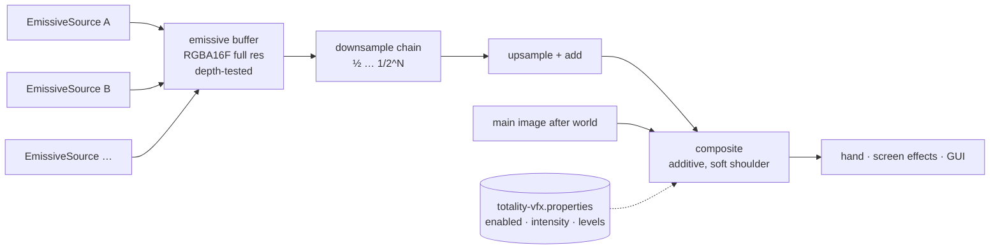

# VFX Experiment 1 — Shared Emissive Bloom: Experiment Report

Date: 2026-10-02 · Status: **approved (2026-10-02), committed locally, not pushed** — see §13 for the final decisions.
Plan: `Context/Audit/TOTALITY_VFX_EXPERIMENT_PLAN.md` · Background: `Context/Audit/TOTALITY_SHOOTING_STAR_VFX_AUDIT.md`
Review bundle: `Context/Audit/Review Bundles/TOTALITY_VFX_EMISSIVE_BLOOM_EXPERIMENT_REVIEW.zip`

> **Terminology update (2026-10-02):** the system described here is now called the **Totality Emissive Rendering
> Layer**. Bloom (the blur chain + composite) is one feature of that layer, not the whole system. See
> `TOTALITY_VFX_EXPERIMENT_PLAN.md` § Terminology. The report text in §1–§12 is unchanged from its delivery.

**Labels:** **[Confirmed]** = tested in this task (real client, automated test or build) · **[Inference]** = technical
interpretation or arithmetic from confirmed data · **[Future]** = an idea that was not implemented.

---

## 1. Goal and answer

> Can Totality support a reusable emissive glow layer without hurting compatibility or performance?

**Answer: yes, in prototype form.**

* **[Confirmed]** The layer works in the real client on **both the OpenGL and the Vulkan backend** of Minecraft 26.2
  (`Using graphics backend Vulkan … radv`), with the same visual result.
* **[Confirmed]** It uses only Blaze3D (`RenderPipeline`, `RenderPass`, `CommandEncoder`, `TextureTarget`,
  `TimerQuery`); a source-level test forbids `org.lwjgl.opengl`, `GL11`, `GL30`, `GlTexture` and `glId()`.
* **[Confirmed]** Only Totality emissive sources glow. Snow, lava, glowstone, a sea lantern and a white wall stay
  pixel-identical outside the sources' own light spill.
* **[Confirmed]** Measured GPU cost of the whole layer on an RX 6600: **0.056 ms at 1280×720 and 0.083–0.087 ms at
  1880×1052 on OpenGL; 0.116–0.119 ms on Vulkan** (1–16 sources). With 400 sources it is 0.080 / 0.110 / 0.146 ms.
* **[Confirmed]** Off is really off: with the layer disabled, at intensity 0, or with no sources, no pass is recorded.
  The GPU buffers are freed after 10 s idle.
* **[Confirmed]** Existing Fireball, Phone and Camera & Gallery capture scenes ran with the layer installed: 178 PASS,
  0 FAIL. Full test suite: 2417 tests, 0 failures.

## 2. Existing rendering analysis (Phase 1)

| area | what exists | relevance |
|---|---|---|
| Heat Vision (`client/renderer/ability/HeatVisionBeamRenderer`) | `LevelRenderEvents.BEFORE_TRANSLUCENT_TERRAIN` callback; a `RenderPipeline` registered from `DEBUG_FILLED_SNIPPET`; `BufferBuilder` + `MappableRingBuffer` + `createRenderPass` into the main target; one draw per frame (documented fence pitfall with the 3-slot ring buffer) | **Reused as the pattern** for the test object and the emissive draw. Note for Experiment 2: its depth test is `LESS_THAN_OR_EQUAL`, while 26.2 uses reversed-Z (default `GREATER_THAN_OR_EQUAL`, depth cleared to 0) — verify the intended occlusion before changing it |
| Spells (`SpellBoltRenderer`, `FireballProjectileRenderer`, `VisualPortalRenderer`) | vanilla `RenderTypes.entityTranslucentEmissive(...)` / `eyes(...)` through the entity submit system | In vanilla, "emissive" means *full-bright*, not bloom. These draws live inside the level's submit/feature system, so intercepting them for glow would be invasive. **Conclusion: sources contribute explicit emissive geometry instead** |
| Particles (`client/particle/firebolt`, `fireball`, `portal`) | `SingleQuadParticle.Layer.TRANSLUCENT` | Not connected in this experiment. **[Future]** a glow contribution per particle effect would be an `EmissiveSource` emitting a few billboards |
| Rendering APIs in Totality | `RenderPipelines.register`, `LevelRenderEvents`, `PictureInPictureRendererRegistry`, no raw GL, no custom shader files before this task | The layer adds Totality's first custom shaders, in vanilla's own resource layout (`assets/totality/shaders/post/*.fsh`) |
| Camera & Gallery (`mixin/client/camera/CameraCaptureMixin`) | photographs are taken between the world and the GUI | The glow composite runs earlier (right after the level), so **[Inference]** photographs include the glow; not tested with a glowing source |
| Minecraft 26.2 frame | `GameRenderer.renderLevel` → `LevelRenderer.render` (frame graph) → depth clear → hand → screen effects; then entity outline, optional vanilla post effect, GUI | **Integration point chosen: right after `LevelRenderer.render` returns** — world colour and depth are final, and the hand, screen effects and GUI come later, so they never glow |
| Vanilla post-processing (`PostChain`, `PostPass`) | data-driven JSON chains; internal targets have fixed pixel sizes and RGBA8; uniforms are fixed at load time | Not used directly: a bloom chain needs screen-relative sizes and a runtime intensity. **Its execution recipe was mirrored** (fullscreen triangle from `core/screenquad`, `bindTexture("<name>Sampler")`, a per-pass uniform ring buffer, `draw(3, 1, 0, 0)`) |

Conflicts found: none with existing systems. The one environment pitfall: on a fresh game directory,
`preferredGraphicsBackend:"vulkan"` in `options.txt` was replaced by `default` and OpenGL started. The official launch
argument `--graphicsBackend vulkan` is reliable. **[Confirmed]**

## 3. Chosen approach

1. **Explicit emissive sources.** An effect implements `EmissiveSource.emit(buffer, camera, partialTick)` and adds
   camera-relative quads (`EmissiveBuffer.quad` / `box`). Its ordinary look is still drawn by its own renderer.
2. **One shared emissive buffer per frame.** All sources are drawn additively into one full-resolution `RGBA16_FLOAT`
   texture, using the world's depth buffer read-only (reversed-Z `GREATER_THAN_OR_EQUAL`), so walls hide glow.
3. **Blur chain.** Downsample `levels` times (5-tap, each level half the previous), then upsample back with an 8-tap
   ring filter that is **added** onto each larger level. This sums glows of several radii.
4. **Composite.** The half-resolution result is added to the main image with a soft shoulder (`1 − e^−x`), so strong,
   overlapping glows do not clip to flat white. Colour only; alpha is untouched.

The cost is fixed per frame, not per source: sources only add emissive triangles to one draw call.

## 4. Architecture

```
GameRenderer.renderLevel
 ├─ LevelRenderer.render(...)            world → main colour + main depth (frame graph)
 │    └─ LevelRenderEvents.BEFORE_TRANSLUCENT_TERRAIN
 │         └─ EmissiveTestScene: ordinary test objects (dev only)          ← "normal rendering"
 ├─ ► GameRendererEmissiveGlowMixin (@At AFTER LevelRenderer.render)
 │    └─ EmissiveGlow.afterLevel
 │         layer off / intensity 0 / no source / nothing emitted → nothing recorded (buffers freed after 10 s)
 │         EmissiveBloomRenderer.render
 │           1 emissive pass  : sources ──quads──► emissive (RGBA16F, full res) + main depth (read only)
 │           2 downsample ×N  : emissive → L0 (½) → L1 (¼) → … → L(N−1)
 │           3 upsample ×N−1  : L(N−1) ─add→ L(N−2) … ─add→ L0
 │           4 composite      : main colour += shoulder(L0 × intensity)
 ├─ depth clear, first-person hand, screen effects     (never glow)
 └─ entity outline, vanilla post effect, GUI           (unchanged)
```



## 5. Files changed

**Modified (tracked):**

| file | change |
|---|---|
| `src/main/java/zcylas/totality/TotalityClient.java` | +1 import, +2 lines: `EmissiveGlow.register();` next to `HeatVisionBeamRenderer.register()` |
| `src/main/resources/totality.mixins.json` | +1 client mixin `client.vfx.GameRendererEmissiveGlowMixin` |

**New:**

| file | purpose |
|---|---|
| `client/vfx/glow/EmissiveGlow.java` | facade: register, add/remove sources, settings, per-frame entry point, dev measurement accessors |
| `client/vfx/glow/EmissiveSource.java`, `EmissiveBuffer.java` | the source contract and its quad/box collector |
| `client/vfx/glow/EmissiveBloomRenderer.java` | GPU work: targets, emissive draw, chain, composite, idle release, `TimerQuery` timing |
| `client/vfx/glow/EmissiveGlowPipelines.java` | 4 `RenderPipeline`s (emissive, downsample, upsample, composite) |
| `client/vfx/glow/EmissiveGlowSettings.java` | `config/totality-vfx.properties`: `glow.enabled`, `glow.intensity` [0, 4], `glow.levels` [2, 6] |
| `client/vfx/glow/GlowChainLayout.java` | chain sizes and memory arithmetic |
| `client/vfx/glow/dev/EmissiveTestScene.java` | dev-only test objects (cubes + beam pillar), drawn normally and as emissive sources |
| `client/vfx/glow/dev/EmissiveGlowDevCommand.java` | dev-only `/totalityvfx glow on/off/intensity/levels`, `test <n>/clear`, `timing on/off` |
| `client/vfx/glow/dev/EmissiveGlowCapture.java` | capture scene 66 (screenshots + timings) |
| `mixin/client/vfx/GameRendererEmissiveGlowMixin.java` | the single frame hook |
| `resources/assets/totality/shaders/post/vfx_glow_{downsample,upsample,composite}.fsh` | original shaders |
| `src/test/java/zcylas/totality/client/vfx/glow/*Test.java` | 12 tests (settings, chain layout, source-level wiring) |
| `Context/Tools/vfx-emissive-bloom/run_glow_capture.sh`, `compare_glow_frames.py` | capture runner (backend parameter) and pixel comparison |
| `Context/Audit/TOTALITY_VFX_EXPERIMENT_PLAN.md`, this report | documentation |

No existing spell, particle, Heat Vision, Phone or rendering code was modified.

## 6. Implementation details

* **Pipelines** (`EmissiveGlowPipelines`):
  * `EMISSIVE` derives from vanilla `DEBUG_FILLED_SNIPPET` (position + colour, quads), with an `ADDITIVE` blend into
    `RGBA16_FLOAT` and depth `GREATER_THAN_OR_EQUAL` without writes.
  * The three fullscreen pipelines derive from `POST_PROCESSING_SNIPPET`, with `core/screenquad` and a bind group of
    `InSampler` plus the `GlowPass` uniform block (`InTexel`, `Intensity`, `Spread`; std140).
  * The composite writes `RGBA8_UNORM` colour channels only.
  * All four are registered through `RenderPipelines.register` at client start, so they join the game's pipeline list
    like Heat Vision's.
* **Uniforms.** One `MappableRingBuffer` per pass, written once per frame and rotated once, the same pattern as
  vanilla `PostPass`. This avoids the ring-buffer fence problem documented in Heat Vision.
* **Emissive draw.** Same recipe as Heat Vision: `BufferBuilder` → `MappableRingBuffer` → `drawIndexed` with
  `DynamicTransforms(viewRotationMatrix)`; the level projection is still bound at the hook. **[Confirmed]** visually:
  the glow sits exactly on the objects.
* **Targets.** `TextureTarget`s without depth, created on first use. They are recreated on window resize or a change
  of levels, and destroyed after 10 s with nothing to draw. The first prototype released after 200 idle *frames*;
  the first run showed that is about 0.13 s at 1,500 fps and caused reallocation churn when toggling. It is now
  time-based. **[Confirmed]** by log lines in both runs.
* **Settings.** Same file conventions as `VoiceSettings` (properties file, defaults on error, atomic save). There is
  no settings screen yet; the dev command edits and saves them.
* **Shaders** are original: a centre plus 4-diagonal downsample, an 8-tap ring upsample, and an exponential shoulder
  composite. Nothing comes from the Shooting Star Demo.
* **Code style:** normal imports only, with no inline fully qualified names in new code (checked), and no unused
  imports.

## 7. Screenshots (in the bundle, `screenshots/`)

All screenshots are real client frames from capture scene 66. The window was clamped by the desktop to
**1880×1052** (requested 1920×1080) and **1280×720**.

| sheet | shows |
|---|---|
| `sheets/01_normal_vs_emissive_opengl_vulkan.png` | **Normal** (glow off: plain cubes and pillar) vs **emissive** (object + glow), on OpenGL and Vulkan |
| `sheets/02_settings_intensity_levels.png` | intensity 0 (no passes) / 0.5 / 1.0 / 2.5, and levels 2 (tight) / 6 (wide) |
| `sheets/03_night.png` | the glow by night: halos light the wall and snow around the sources only |
| `sheets/04_occlusion_and_400_sources.png` | a stone pillar hides a source and its glow; 400 sources stress frame |
| `sheets/05_baseline_vs_restored.png` | no sources before vs after the test (identical static regions) |
| `full/*.png` | full-size frames (OpenGL, Vulkan, 720p) |
| `diffs/*.png` | amplified (×8) difference images |

Visual assessment (for review, subjective):

* Intensity 1.0 with 5 levels gives a soft, readable glow.
* At 2.5 the object faces wash out towards white; a wide halo needs either more levels or a "halo-only" mode
  ([Future], §11).

## 8. Performance observations

**GPU time of the whole layer** (emissive draw + chain + composite), from `TimerQuery` GPU timestamps around the passes,
averaged over 100 ticks per row. AMD Radeon RX 6600, Mesa 26.2.3. **[Confirmed]**

| setting | OpenGL 1280×720 | OpenGL 1880×1052 (run 1 / run 2) | Vulkan 1880×1052 |
|---|---|---|---|
| 1 source (12 quads), 5 levels | 0.056 ms | 0.083 / 0.083 ms | 0.116 ms |
| 16 sources (96 quads) | 0.056 ms | 0.085 / 0.087 ms | 0.119 ms |
| 100 sources (600 quads) | 0.061 ms | 0.093 / 0.094 ms | 0.126 ms |
| 400 sources (2400 quads) | 0.080 ms | 0.110 / 0.110 ms | 0.146 ms |
| 16 sources, levels 2 / 3 / 4 / 5 / 6 | 0.041 / 0.048 / 0.053 / 0.055 / 0.058 | 0.064 / 0.074 / 0.079–0.081 / 0.084–0.085 / 0.090 | 0.087 / 0.100 / 0.112 / 0.115 / 0.119 |
| layer off or no sources | no passes recorded | no passes recorded | no passes recorded |

**Memory** of the layer's GPU buffers, from the log lines (`[Totality VFX] glow buffers …`). **[Confirmed]**
9,597 KiB at 1280×720 and 20,594 KiB at 1880×1052 (5 levels). Levels hardly matter (2 levels: 20,279 KiB). The
full-resolution float emissive buffer is **75 %** of it.

**Estimated** (not measured) **[Inference]**:

* **Memory** (exact formula, verified against both logged sizes): 21.1 MiB at 1920×1080, 37.5 MiB at 2560×1440,
  84.4 MiB at 3840×2160.
* **GPU time:** on OpenGL it fits about 0.031 ms + 0.0275 ms per megapixel, giving ≈ 0.13 ms at 1440p and
  ≈ 0.26 ms at 4K on this GPU. Higher resolutions could not be tested: the window is clamped to the monitor.
* **Sources:** they cost only their quads. 400 sources (2,400 quads) add 0.02–0.03 ms. The fixed chain dominates.
* **Weaker GPUs:** these are a mid-range desktop GPU's numbers. **Integrated GPUs were not tested**; expect several
  times higher figures.

**Frame rate** (logged for context only): about 800–1,500 fps throughout. The runs are not GPU-bound, so fps does not
measure the layer's cost; the GPU timestamps above do. Vulkan's higher numbers are consistent across all rows. Why
the backend differs was not investigated.

## 9. Compatibility notes

| check | result |
|---|---|
| OpenGL backend | **[Confirmed]** 3 runs (two at 1880×1052, one at 1280×720), 2/2 + 2/2 + 178/178 PASS |
| Vulkan backend | **[Confirmed]** forced with `--graphicsBackend vulkan`; log `Using graphics backend Vulkan, using drivers: 1.4.354 radv Mesa 26.2.3`; 2/2 PASS, same visuals |
| Off restores the normal image | **[Confirmed]** "baseline (no sources)" vs "restored (after on/off/settings/clear)": snow, wall and glowstone regions max difference 0 in all four runs (except one pixel on the wall's left edge in the Vulkan run, at x 440, which changes the same way in the glow-off/on pair: background scenery behind the edge, not glow). With the layer off, disabled, or at intensity 0, `active()` is false and the renderer returns before recording anything (unit test + code path). Whole-frame differences come from moving clouds, animated lava and sea-lantern textures and lava smoke particles, so comparisons use static regions |
| Vanilla bright surfaces don't bloom | **[Confirmed]** by construction (they never enter the buffer) and by pixels: with glow on, the far side of the glowstone stays at 0. Values of 1–5/255 appear only where the sources' own halos spill onto nearby surfaces, and they fall off towards the sources (720p glowstone columns: 0, 0, 0, 1, 4 nearest the cube) |
| Existing spells | **[Confirmed]** Fireball scene 58 (570 frames, entity and emitter counts back to 0) ran with the layer installed. Spells don't use the layer yet, so their look is unchanged |
| Phone | **[Confirmed]** Phone prototype scene 64 (home, pages, shade, notifications, bounds, dev commands) and Camera & Gallery scene 65: all PASS |
| Heat Vision | **[Inference]** unaffected (code untouched; layer idle unless a source exists). Not exercised in a capture |
| Automated tests | **[Confirmed]** `./gradlew build` successful; 2417 tests, 0 failures, 2 skipped (baseline 2405/0/2) |
| Fabulous graphics, shader packs (Iris), Sodium, integrated GPUs, other vendors, dedicated-server play | **Not tested** |

**Known limitations** **[Confirmed]** unless marked:

* **Glow bleeds over occluders in front.** The blur is screen-space and ignores depth, so the halo of a source next to
  an occluder spreads over the occluder's edge (see the occlusion frame). The source itself is correctly hidden.
* **Stacked sources saturate.** 400 overlapping sources become one bright field (the shoulder prevents flat white). A
  future API needs per-effect brightness budgets.
* **Translucency and particles.** [Inference] Water, stained glass and particles in front of a source do not occlude
  its glow: they don't write the main depth, or in Fabulous mode write it to separate targets.
* **Memory at 4K.** ≈ 84 MiB while active, mostly the full-resolution float emissive buffer ([Future]: half
  resolution or a 4-byte format).
* **Duplicate draw.** Sources draw their emissive part a second time. This is cheap for simple shapes, but complex
  models would need a simplified emissive proxy.

## 10. What was learned

1. **Minecraft 26.2 has a clean, supported path for custom post-processing.** `RenderPipeline` (with custom
   colour-target formats and blend), `createRenderPass` against any `GpuTextureView`, custom shaders in the mod's
   namespace, and `TimerQuery`. One implementation ran unchanged on OpenGL and Vulkan.
2. **Reversed-Z matters.** All custom depth tests must use `GREATER_THAN_OR_EQUAL`.
3. **Hook placement decides what glows.** Right after `LevelRenderer.render` is the natural point: depth is final and
   the hand and GUI are excluded without special cases.
4. **The cost is small and almost independent of source count.** A shared layer is the right shape for "twenty
   casters at once", as the audit predicted; here it is measured.
5. **Explicit emissive contribution beats intercepting render types.** It keeps the layer isolated and makes
   brightness a deliberate design choice per effect.
6. **Tooling.** `--graphicsBackend` is needed to test Vulkan reliably. Frame-count timers are wrong at uncapped frame
   rates. Static-region pixel comparisons are needed because lava, clouds and particles animate.

## 11. Should this become part of a future VFX API?

**Recommendation: yes, as the "glow layer" of the future VFX system**, after these changes [Future]:

1. **Lifecycle and ownership.** Sources registered by effect instances with automatic removal (owner, expiry), not a
   global list managed by hand.
2. **Brightness budget.** Clamp or normalise total emissive energy per effect and per frame, so crowds stay readable.
3. **Quality tiers.** Off / low (3 levels, half-resolution emissive buffer) / medium (5) / high (6), exposed in a
   Totality settings screen. Consider a 4-byte format (`RG11B10_FLOAT`) to halve memory.
4. **Optional depth-aware upsample**, to reduce bleed over near occluders, if reviewers find it distracting.
5. **"Halo-only" option**: subtract part of the source's own emissive in the composite, so strong glows don't wash out
   object colours.
6. **Integration targets, in order:** Heat Vision V2 (Experiment 2: the beam core emits), Fire Bolt and Fireball cores,
   portals, then Meteor Swarm (Experiment 5).
7. **More test coverage:** Fabulous graphics, an integrated GPU, Iris and Sodium if Totality intends to support them.

Not recommended: making existing full-bright render types glow automatically. That would light up every
`eyes`-style vanilla or mod texture and break the "only Totality effects glow" rule.

## 12. How to reproduce

```
./gradlew build
Context/Tools/vfx-emissive-bloom/run_glow_capture.sh gl1080 1920 1080 opengl          # scene 66
Context/Tools/vfx-emissive-bloom/run_glow_capture.sh vk1080 1920 1080 vulkan          # forced Vulkan
Context/Tools/vfx-emissive-bloom/run_glow_capture.sh gl720regr 1280 720 opengl 58,64,65,66
python3 Context/Tools/vfx-emissive-bloom/compare_glow_frames.py build/vfx-glow-capture-gl1080/screenshots gl1080 <out>
```

In a development client: `/totalityvfx test 4`, `/totalityvfx glow off|on`, `/totalityvfx glow intensity 2`,
`/totalityvfx timing on`, `/totalityvfx timing`.

## 13. Final decisions (finalization, 2026-10-02)

* **Approved** as the shared emissive rendering prototype. Official system name: **Totality Emissive Rendering
  Layer**. Bloom is one feature of the layer, not the name of the system.
* **Kept unchanged:** the prototype class names (`EmissiveGlow`, `EmissiveSource`, `EmissiveBloomRenderer`, …; no
  naming refactor), the shared emissive buffer, the bloom implementation, and the OpenGL and Vulkan compatibility.
  The layer's code was not changed during finalization except one Javadoc sentence in `EmissiveGlow` (in the Heat
  Vision V2 commit) that now names Heat Vision V2 as its first production source.
* **Deferred future improvements** (§11): generalised effect ownership and automatic lifecycle management; global
  and per-effect brightness budgeting; graphics quality tiers and settings-screen integration; optional reduction of
  glow bleeding around occluding geometry; additional compatibility testing.
* The roadmap and the permanent technical lessons are maintained in `TOTALITY_VFX_EXPERIMENT_PLAN.md`.
