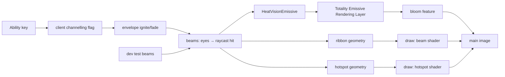

# VFX Experiment 2 — Heat Vision Beam V2: Experiment Report

Date: 2026-10-02 · Status: **approved (2026-10-02), committed locally, not pushed** — see §13 for the final decisions.
Plan: `Context/Audit/TOTALITY_VFX_EXPERIMENT_PLAN.md` (now with the terminology section) ·
Previous: `TOTALITY_SHOOTING_STAR_VFX_AUDIT.md`, `TOTALITY_VFX_EMISSIVE_BLOOM_EXPERIMENT_REPORT.md`
Review bundle: `Context/Audit/Review Bundles/TOTALITY_VFX_HEAT_VISION_V2_EXPERIMENT_REVIEW.zip`

**Labels:** **[Confirmed]** = tested here (real client, automated test or build) · **[Inference]** = interpretation or
arithmetic from confirmed data · **[Future]** = not implemented.

**Terminology:** the system from Experiment 1 is the **Totality Emissive Rendering Layer**. Bloom is one feature of
it (the blur chain and composite). See the plan's Terminology section.

---

## 1. Goal and answer

> Can an existing Totality ability become significantly more visually impressive using the new VFX foundation while
> remaining performant and maintainable?

**Yes.** **[Confirmed]**

* **Before:** in first person, Heat Vision showed as a few red pixels at the crosshair; in third person the beam came
  from the wrong place.
* **After:** two readable energy beams leave the eyes, with a white-hot core, an orange body, a red rim and energy
  flowing outwards. A hotspot sits at the impact, and the glow comes from the Emissive Rendering Layer.
* It works on **OpenGL and Vulkan**.
* **Cost** of one player's Heat Vision is **0.003 ms (OpenGL) / 0.011 ms (Vulkan)** for the beam itself, plus the
  shared Emissive Rendering Layer pass (≈ 0.10–0.11 ms, shared with every other glowing effect).
* **Draw calls:** 2 for any number of beams.

The investigation also **confirmed the suspected depth bug**: the pre-V2 beam's depth test was inverted under 26.2's
reversed-Z. It drew only where something was in front of it.

## 2. Existing Heat Vision analysis (Phase 0)

| part | finding | decision |
|---|---|---|
| Server (`api/ability/kryptonian/HeatVisionAbility`) | Channelled (`Type.CHANNELED`), Kryptonian only, 2 mana per tick, 20-block raycast (entities first, then blocks), radiant damage 2 per tick, scorches ice → water, snow → removed, flammable blocks → fire | **Untouched** |
| Client/server interaction | The client sets its channelling flag itself when the ability key changes (`TotalityKeybindHandlers`) and sends `ToggleAbilityPayload`. No beam data goes to other players, so **only the caster sees the beam** **[Confirmed in code]**. [Inference, not tested] if the server refuses (not Kryptonian, no mana) the client may still show a beam until a sync clears the flag | Untouched; noted for the future (§9) |
| Rendering hook | `LevelRenderEvents.BEFORE_TRANSLUCENT_TERRAIN`, direct `createRenderPass` into the main target, `MappableRingBuffer` (one draw per frame because of the documented 26.2 fence pitfall) | **Reused** (same event, same buffer pattern) |
| Pipeline | `DEBUG_FILLED_SNIPPET` (position + colour, translucent blend), cull off, depth `LESS_THAN_OR_EQUAL`, no depth write, depth bias (−4, −100) | **Replaced** in V2; kept only in a dev-only A/B renderer |
| Geometry | 3 nested boxes per eye (core 0.006, mid 0.015, outer 0.03 half-width), flat colours, no animation. Start point **camera + 0.5 × look ± 0.06**, i.e. from the camera, not the eyes | **Replaced** |
| Animation | none (on/off) | Added |
| Head bob | `viewRotationMatrix` instead of the bobbing model-view (an earlier fix) | **Kept** |

**Depth issue: verified, not assumed.** **[Confirmed]** I built a side-on probe: a test beam 10 blocks ahead that
passes *behind* a deepslate block and a stone pillar (both 6 blocks ahead). The probe was drawn with the original
pipeline and with V2, on both backends (sheet `02_depth_probe.png`):

* **Original pipeline:** the beam appears **only over the deepslate and the pillar**, where it is hidden in reality,
  and is **invisible in open air**. The test is inverted under reversed-Z (depth cleared to 0, nearer = larger).
* **V2** (`GREATER_THAN_OR_EQUAL`): hidden behind both, visible in the open.
* Identical on OpenGL and Vulkan.

**[Inference]** This explains the "before" first-person look. The beam is in open air in front of its target, so the
inverted test rejects it, and only fragments pushed through by the large slope-scaled bias survive: a few red pixels
and the broken white dashes visible in the zoomed before-frames.

## 3. Changes made

**Modified (tracked or from Experiment 1):**

| file | change |
|---|---|
| `client/renderer/ability/HeatVisionBeamRenderer.java` | Rewritten as V2: same class, same `register()` / `close()` and render event; new origin, geometry, shading, envelope, impact, emissive hand-off, dev hooks |
| `client/vfx/glow/dev/EmissiveGlowDevCommand.java` | `/totalityvfx` hub: registers capture scene 67 and the `heatvision` subcommand (2 small edits) |
| `Context/Audit/TOTALITY_VFX_EXPERIMENT_PLAN.md` | Terminology section; Experiment 1/2 status |
| `Context/Audit/TOTALITY_VFX_EMISSIVE_BLOOM_EXPERIMENT_REPORT.md` | Terminology note at the top (body unchanged) |

**New:**

| file | purpose |
|---|---|
| `client/renderer/ability/HeatVisionBeam.java` | One beam per frame (start, end, hit, strength, length) |
| `client/renderer/ability/HeatVisionGeometry.java` | Pure ribbon and hotspot geometry (unit-tested) |
| `client/renderer/ability/HeatVisionEmissive.java` | Contribution to the Emissive Rendering Layer (`EmissiveSource`) |
| `client/renderer/ability/HeatVisionClassicRenderer.java` | The pre-V2 renderer, **development A/B only** (same pipeline and geometry as before) |
| `assets/totality/shaders/core/heat_vision.vsh`, `heat_vision_beam.fsh`, `heat_vision_hotspot.fsh` | Original shaders |
| `client/vfx/heatvision/dev/HeatVisionDev.java` | `/totalityvfx heatvision classic on/off`, `test <n>/clear`, `timing on/off` |
| `client/vfx/heatvision/dev/HeatVisionCapture.java` | Capture scene 67 (before/after views, probe, distance, impact, measurements, cleanup check) |
| `src/test/.../renderer/ability/HeatVisionGeometryTest.java`, `HeatVisionV2WiringTest.java` | 13 tests |

**Untouched:** the server ability, networking, keybinds, `GameRendererMixin`, and **the Emissive Rendering Layer
code**. It needed no change to take its first real consumer.

## 4. Architecture

```
client tick ── TotalityKeybindHandlers → ClientAbilityManager.channeling ─────────────┐
                                                                                      ▼
LevelRenderer.render ─► LevelRenderEvents.BEFORE_TRANSLUCENT_TERRAIN ─► HeatVisionBeamRenderer.render
     envelope: ignite 0.18 s / fade 0.12 s (time-based)
     beams: player (2, from the eyes; 1st person below+beside the view) + dev test beams
     ├─ HeatVisionGeometry.ribbon  ─► BufferBuilder ─► draw #1  pipeline heat_vision_v2_beam    (additive, GEQ, no depth write)
     ├─ HeatVisionGeometry.hotspot ─► BufferBuilder ─► draw #2  pipeline heat_vision_v2_hotspot (additive, GEQ, no depth write)
     └─ HeatVisionEmissive.submit(beams)   (no beams → removeSource: clean-up)
                                                  │ same frame
GameRenderer.renderLevel ─► (after LevelRenderer.render) ─► Totality Emissive Rendering Layer
     HeatVisionEmissive.emit: core ribbon (45 % width, capped colour) + hotspot quad → shared emissive buffer
     → bloom feature (down/up chain) → additive composite                     (one pass set for all sources)
client tick ─► impact particles (smoke every 2 ticks, small flame every 5) at the local beam's block hit
```



## 5. V2 in detail

1. **Beam appearance.**
   * The ribbon always faces the camera and is split into 24 segments.
   * The fragment shader (`heat_vision_beam.fsh`) builds the colour from the distance to the axis: a white-hot core
     (`exp(-26x²)`), an orange body (`exp(-5.5x²)`) and a red rim. The body width breathes slightly with the flow, so
     the edge reads as moving energy.
   * Output is additive light, so the beam is brightest where it is hottest.
2. **Readability at distance.** Ribbon half-width = `clamp(0.05 blocks, distance × 0.0018 rad, distance × 0.018 rad)`:
   * **never thinner** than about 1.5 px on screen (far beams stay readable — sheet `03_distance.png`);
   * **never wider** than about 13 px, so the part next to the camera cannot fill the screen.
3. **Beam origin.**
   * First person: 0.30 ahead, 0.11 to each side, 0.09 below the eye line, so the two beams converge on the target
     instead of collapsing into a dot.
   * Third person: from the face (0.26 ahead, 0.065 to each side).
4. **Animation.**
   * Two noise octaves scroll along the beam (energy flowing away from the eyes) plus a fast shimmer, driven by
     vanilla's `Globals.GameTime`.
   * Ignition: the beam grows from the eyes over 0.18 s. Fade-out over 0.12 s.
   * Noise is keyed to distance along the beam in blocks, so it doesn't swim when the player moves.
   * **[Confirmed]** stable in all captured frames; no motion test beyond the capture.
5. **Near-camera fade.** Vertex alpha fades to 0 within 1.2 blocks of the camera. Beams emerge softly from the eyes,
   and a beam that passes through the camera cannot flood the view (the problem found in tuning, §8).
6. **Impact point.**
   * A camera-facing hotspot (`heat_vision_hotspot.fsh`): white centre, orange-red falloff, ragged flickering edge.
     It is pulled 0.2 blocks towards the camera so the hit surface doesn't cut it.
   * Small vanilla smoke and flame particles at block hits (local beam only).
   * No terrain destruction; the server's existing scorching is unchanged.
7. **Emissive Rendering Layer integration** (`HeatVisionEmissive`).
   * Each frame the beams are handed over and **consumed once**. With no beam, the source unregisters itself.
     **[Confirmed]** by the capture check "Heat Vision left the Emissive Rendering Layer after the beam stopped":
     PASS on OpenGL and Vulkan.
   * Brightness is capped per beam: core `(1.0, 0.32, 0.06)` and hotspot `(1.0, 0.45, 0.12)` at full strength, scaled
     by the envelope. The layer itself has no global budget yet ([Future]).
8. **Depth.** Reversed-Z `GREATER_THAN_OR_EQUAL`, no depth writes, additive blending.

## 6. Screenshots (bundle `screenshots/`)

Real client frames from capture scene 67. Window: before run 1880×1052, after runs **1920×1012** (requested
1920×1080; the desktop clamps the window).

| sheet | content |
|---|---|
| `sheets/01_before_after.png` | **Before (current) vs after (V2)**: far wall, near block, into the sky, far wall at night, third person back and front |
| `sheets/02_depth_probe.png` | Classic vs V2 depth behaviour, OpenGL and Vulkan |
| `sheets/03_distance.png` | Beams crossing at ~5, 10 and 17 blocks, classic vs V2 |
| `sheets/04_emissive_layer_off_on.png` | The same V2 beam with the Emissive Rendering Layer off and on, day and night |
| `sheets/05_impact_multi_cleanup.png` | Impact hotspot day and night, 66 beams, frame after stopping |
| `sheets/06_tuning_iterations.png` | Untuned → max width 0.012 rad → final 0.018 rad (first person, and third-person front blowout) |
| `sheets/07_vulkan.png` | V2 on Vulkan |
| `full/*.png` | Selected full-size frames |

## 7. Performance results

`TimerQuery` GPU timestamps around the Heat Vision draws, and the Emissive Rendering Layer's own measurement; 100-tick
averages; AMD RX 6600; 1920×1012. "Test beams" are client-only beams through the same code path. Classic and V2 were
measured in the **same run**, so they are directly comparable. **[Confirmed]**

| beams | V2 draws | V2 beam GPU (GL / VK) | Emissive Rendering Layer GPU, shared (GL / VK) | classic draws | classic GPU (GL / VK) |
|---|---|---|---|---|---|
| 2 (one player) | 2 | 0.003 / 0.011 ms | 0.100 / 0.113 ms (50 emissive quads) | 1 | 0.002 / 0.006 ms |
| 18 | 2 | 0.011 / 0.021 ms | 0.114 / 0.124 ms (450) | 1 | 0.005 / 0.012 ms |
| 66 | 2 | 0.036 / 0.057 ms | 0.129 / 0.150 ms (1,650) | 1 | 0.020 / 0.029 ms |
| 258 | 2 | 0.206 / 0.225 ms | 0.224 / 0.223 ms (6,450) | 1 | 0.088 / 0.100 ms |

* **Vertex memory** (3-slot ring buffers) **[Confirmed]** from the renderer: 72 KiB for one player, 169 KiB for 18
  beams, 493 KiB for 66, 1,838 KiB for 258 (V2, beam and hotspot rings together). Classic at 258 beams: 846 KiB
  (2,684 KiB total minus the V2 rings still allocated in the same run).
* **Emissive buffers:** none extra. Heat Vision uses the existing layer buffers (≈ 20 MB at this resolution, allocated
  only while something glows; Experiment 1).
* **Comparison:** V2 beam drawing costs about 1.5–2.5× classic per beam (24-segment ribbons and a per-pixel shader
  instead of flat boxes), but stays in the hundredths of a millisecond for realistic counts.
  **[Inference]** For one caster the dominant cost is the shared layer pass (≈ 0.1 ms). Any other glowing effect on
  screen pays it anyway, so in a fight it is not a per-ability cost.
* **[Inference]** CPU: geometry is rebuilt every frame on the render thread: 24 segments × 2 beams, plus a raycast per
  frame (as before). Not separately profiled.
* Frame rates are logged in the capture logs for context only. These runs are not GPU-bound, so fps does not measure
  the effect.

## 8. Compatibility results

| check | result |
|---|---|
| OpenGL | **[Confirmed]** after-run: views, probe, distance, impact, measurements, cleanup PASS |
| Vulkan | **[Confirmed]** forced with `--graphicsBackend vulkan` (log: `Using graphics backend Vulkan … radv`). Same visuals; Emissive Rendering Layer scene 66 + Heat Vision scene 67: 3 PASS, 0 FAIL |
| Emissive Rendering Layer still works | **[Confirmed]** scene 66 on Vulkan (2/2) and on OpenGL in the regression run, with the same timings as Experiment 1 |
| Phone | **[Confirmed]** Phone prototype scene 64: all PASS (regression run) |
| Camera / Gallery | **[Confirmed]** scene 65: all PASS (regression run) |
| Existing spell rendering | **[Confirmed]** Fireball scene 58 (570 frames, entity and emitter counts back to 0): PASS |
| Regression run total | **[Confirmed]** OpenGL, scenes 58, 64, 65, 66 with final code: **187 PASS, 0 FAIL, 0 timeouts** |
| Build and tests | **[Confirmed]** `./gradlew build` successful; **2430 tests, 0 failures**, 2 skipped (before: 2417 / 0 / 2) |
| Not tested | Real key-press activation by a Kryptonian player with mana (captures set the client flag; the server ability is unchanged); multiplayer; Fabulous graphics; shader packs; integrated GPUs |

## 9. Problems discovered

1. **Inverted depth test in the pre-V2 beam** (§2): **[Confirmed]** on both backends. Fixed in V2.
2. **Beam started at the camera**: wrong in third person, and in front view the beam didn't come from the player.
   **[Confirmed]** Fixed (eye-based origins).
3. **End-on beam in first person**: a beam straight along the view axis can only be a dot. **[Confirmed]** Fixed by
   the offset origins.
4. **Near-camera blowout** in the first V2 tuning: ribbon segments close to the camera covered half the screen and
   additive light whited it out (third-person front, test fans). **[Confirmed]** Fixed with a maximum angular width
   and a near-camera fade. Tuning took three captured iterations (sheet 06).
5. **Third person back:** the beams are hidden behind the player's own head, because they travel away from the camera
   along the view line. Correct with proper depth. **[Confirmed]**, left as is.
6. **Only the caster sees Heat Vision**: no beam state reaches other clients. **[Confirmed in code]**, not changed
   (networking is out of scope). [Future] a small "channelling Heat Vision" sync so watchers can render it with the
   same V2 code, which already supports several beams per frame.
7. **Optimistic client flag** ([Inference], not tested): the client shows the beam as soon as the key is held, even
   if the server refuses activation.
8. **Inherited from the layer:** glow bleeds slightly over near occluders (Experiment 1 limitation).

## 10. Lessons learned

1. **The VFX foundation pays off immediately.** The Emissive Rendering Layer took its first real consumer with no
   change to its code. Heat Vision only implements `EmissiveSource` and hands over geometry once per frame.
2. **Correct depth is the first VFX bug to check on 26.2.** Reversed-Z silently inverts any custom
   `LESS_THAN_OR_EQUAL` depth test. A side-on probe beam behind an occluder exposes it in one frame.
3. **Screen-space width limits matter as much as shading.** A minimum and a maximum angular width, plus a
   near-camera fade, made the difference between "invisible dot" and "blinding wedge".
4. **Effects should be built around a list of instances.** Drawing N beams in 2 draw calls came for free and made
   multi-beam measurement trivial.
5. **A/B in the same run** (classic vs V2, same frame times, same scene) gives honest comparisons.

## 11. Should this approach become part of the future VFX API?

**Yes.** Recommended building blocks **[Future]**:

* **Beam primitive:** camera-facing segmented ribbon with min/max angular width, near fade, UV along the length, and
  shader-driven energy flow. It applies to Heat Vision, lightning, laser spells, tethers and channelled beams.
* **Impact primitive:** camera-facing hotspot pulled towards the camera, plus optional particles.
* **Emissive contribution helper:** one `EmissiveSource` per effect type that consumes per-frame instances and
  unregisters itself. It should become a standard pattern (or a small base class) in the VFX API.
* **Envelope helper:** time-based ignite/fade.
* Next steps worth a decision:
  1. Sync beam state so other players see Heat Vision.
  2. A global emissive brightness budget in the layer.
  3. A beam-colour parameter, so other abilities reuse the shader.
  4. A decision whether the dev-only classic renderer should be deleted after review (it exists only for this A/B
     comparison).

## 12. How to reproduce

```
./gradlew build
Context/Tools/vfx-emissive-bloom/run_glow_capture.sh hvafter_gl 1920 1080 opengl 67
Context/Tools/vfx-emissive-bloom/run_glow_capture.sh hvafter_vk 1920 1080 vulkan 66,67
Context/Tools/vfx-emissive-bloom/run_glow_capture.sh hvregr_gl 1920 1080 opengl 58,64,65,66
```

In a development client: `/totalityvfx heatvision test 16`, `/totalityvfx heatvision classic on|off`,
`/totalityvfx heatvision timing on`, `/totalityvfx heatvision`. The before frames came from the untouched pre-V2 code
(run `hvbefore_gl`, before any renderer change).

## 13. Final decisions (finalization, 2026-10-02)

* **Approved** as a successful prototype. Preserved without redesign: the corrected reversed-Z depth handling,
  eye-based beam origins, white-hot core / orange body / red edge, animated energy flow, ignition and fade, the impact
  hotspot and particles, near-camera fading and screen-space width limits, the Emissive Rendering Layer integration,
  and the unchanged server-side gameplay.
* **`HeatVisionClassicRenderer`** is kept for now, **exclusively as a development-only comparison and debugging
  tool** (answers §11 item 4). Isolation: it is reachable only through `/totalityvfx heatvision classic` and capture
  scene 67, which are registered only in a Fabric development environment; during finalization
  `HeatVisionBeamRenderer.setClassic` was additionally made to ignore the switch outside a development environment,
  and `HeatVisionV2WiringTest` asserts both guards.
* **Deferred** (not implemented): multiplayer visibility, i.e. syncing beam state so other players see Heat Vision
  (§9 item 6, a future ability-synchronisation task); the optimistic client flag that can show Heat Vision before the
  server accepts activation (§9 item 7); the global emissive brightness budget (future VFX API).
* The roadmap, permanent technical lessons and candidate VFX API components are maintained in
  `TOTALITY_VFX_EXPERIMENT_PLAN.md`.
